```{r setup, include=FALSE}
# Use 'verbatim = TRUE' as chunk option to show chunk code as is
require(knitr)
hook_source_def = knit_hooks$get('source')
knit_hooks$set(source = function(x, options){
  if (!is.null(options$verbatim) && options$verbatim){
    opts = gsub(",\\s*verbatim\\s*=\\s*TRUE\\s*", "", options$params.src)
    bef = sprintf('\n\n    ```{r %s}\n', opts, "\n")
    stringr::str_c(bef, paste(knitr:::indent_block(x, "    "), collapse = '\n'), "\n    ```\n")
  } else {
     hook_source_def(x, options)
  }
})
```

## Computational biology {.larger}

&nbsp;

<center></center>

&nbsp;

<div style="font-size: small;">
Markowetz, Florian. “All Biology Is Computational Biology.” _PLoS Biology_ March 2017. http://journals.plos.org/plosbiology/article?id=10.1371/journal.pbio.2002050
</div>

## The human genome in a nutshell {.larger}

- Human genome is big - ~3.2 billion base pairs (~6ft long)
- 20,000-25,000 genes (~2% of the genome)

<center></center>

<div style="font-size: small;">http://www.bio.miami.edu/dana/250/250SS14_17print.html</div>

## Genome is more than genes

- Human genome contains ~4M single nucleotide polymorphisms (SNPs)

- Only 12% of SNPs are located in, or occur in tight linkage disequilibrium with, protein-coding regions.

<center>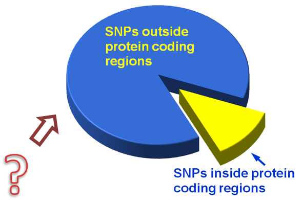</center>

<div style="font-size: small;">Hindorff LA. et.al. "Potential etiologic and functional implications of genome-wide association loci for human diseases and traits" PNAS 2009, http://www.pnas.org/content/106/23/9362.long</div>

## Genome contains millions of regulatory regions {.larger}

- DNaseI hypersensitive sites
- Histone modification marks
- Transcription Factor Binding Sites
- DNA methylation
- Enhancers
- ...

Collectively referred hereafter as _epigenomic_ or _regulatory_ regions

## Definition of Epigenomics {.larger}

**Epigenomic data** = genome annotation data = regions other than DNA sequence, annotated as carrying functional/regulatory potential or having a biological property

<center></center>

<center>**Conrad Hal Waddington** - the father of epigenetics</center>


## Genome annotation consortia

<center>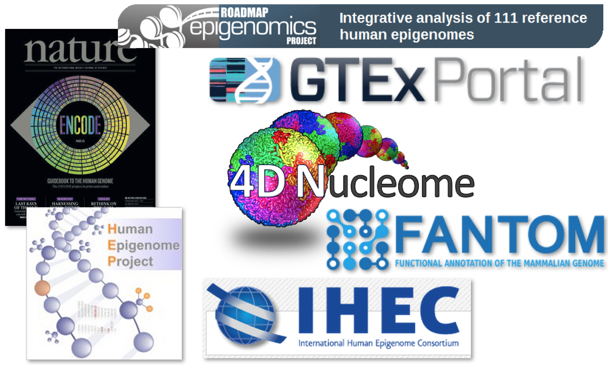</center>

## Gap between data generation & data understanding {.larger}

**There is a growing gap between the generation of massively parallel sequencing output and the ability to process and analyze the resulting data**. New users are left to navigate a bewildering maze of base calling, alignment, assembly and analysis tools with often incomplete documentation and no idea how to compare and validate their outputs. **Bridging this gap is essential, or the coveted $1,000 genome will come with a $20,000 analysis price tag**.

&nbsp;

<div style="font-size: small;">McPherson, John D. “Next-Generation Gap.” Nature Methods 2009 http://www.nature.com/nmeth/journal/v6/n11s/full/nmeth.f.268.html</div>

## GenomeRunner – a global positioning system within the genome

- Finds significantly enriched co-localizations of genomic data with epigenomic data

<center></center>

<div style="font-size: small;">http://www.integrativegenomics.org</div>

<!--
## Growth of genomic data

<center>

</center>

&nbsp;

<div style="font-size: 40%;">
- Muir et al., “The Real Cost of Sequencing.” Genome Biol. 2016

https://genomebiology.biomedcentral.com/articles/10.1186/s13059-016-0917-0
</div>

***

<center>

</center>

<div style="font-size: small;">Michael Eisenstein. Nature 527, S2–S4 (05 November 2015) http://www.nature.com/nature/journal/v527/n7576_supp/full/527S2a.html</div>
-->

# Epigenomic enrichment analysis

## What is enrichment analysis? {.larger}

**Enrichment analysis** – detecting whether a group of objects has certain properties more (or less) frequent than can be expected by chance

>- **Gene set enrichment analysis** - detecting whether _genes_ of interest, such as differentially expressed genes, are annotated with certain _gene annotations_ (molecular functions, canonical pathways) more (or less) frequent than can be expected by chance

>- **Epigenomic enrichment analysis** - detecting wehther _genomic regions_ of interest, such as disease-associated genomic variants, are annotated with certain _genome annotations_ (chromatin states, transcription factor binding sites) more (or less) frequent than can be expected by chance


## Enrichment = functional impact {.larger}

- **Hypothesis**: SNPs in epigenomic regions may disrupt regulation
- More significant enrichment => more SNPs in epigenomic regions => more regulation is disrupted (SNP burden)
 
<center></center>

&nbsp;

<center>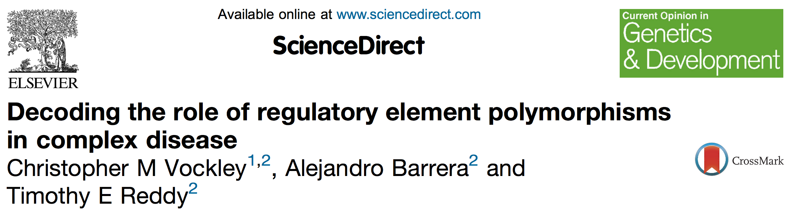</center>

<div style="font-size: small;">Vockley, CM. et.al. “Decoding the Role of Regulatory Element Polymorphisms in Complex Disease.” _Current Opinion in Genetics & Development_ April 2017 https://www.ncbi.nlm.nih.gov/pubmed/27984826
</div>

<!--
## Enrichment = functional impact | Why do we care? {.larger}

- Epigenomic elements enriched in SNPs (altered by them) may be the new therapeutic target

- Systems biology approach - don't try to fix one faulty SNP, target the whole regulatory system affected by all SNPs

## What GenomeRunner analyzes? {.larger}

Experimental data vs. epigenomic data

- Differentially expressed genes, promoters
- Differentially methylated regions
- SNPs, copy number variations, Insertions/Deletions, Structural Variants
- ChIP-seq peaks
- 3D interacting regions
- ...
-->

## Statistics of epigenomic enrichments {.larger}

<center></center>

&nbsp;

- 6 out of 7 disease-associated SNPs overlap with epigenomic marks
- How likely this to be observed by chance? (Fisher's exact/Chi-square/Binomial/Permutation test)

<!--
## Statistics of epigenomic enrichments {.larger}

**Hypergeometric test**

- $m$ is the total number of SNPs
- $j$ is the number of SNPs annotated with a property
- $n$ is the number of selected SNPs
- $k$ is the number of selected SNPs annotated with a property

<center></center>

## Statistics of epigenomic enrichments {.larger}

**Hypergeometric test**

- $m$ is the total number of SNPs
- $j$ is the number of SNPs annotated with a property
- $n$ is the number of selected SNPs
- $k$ is the number of selected SNPs annotated with a property

|                    | Selected SNPs    | Not selected SNPs    | Total |
|--------------------|:----------------:|:--------------------:|:------|
| Annotated          |        k         |           j-k        | j     |
| Not annotated      |       n-k        |         m-n-j+k      | m-j   |
| Total              |       n          |           m-n        |  m    |

## Statistics of epigenomic enrichments {.larger}

**Hypergeometric test**

- $m$ is the total number of SNPs
- $j$ is the number of SNPs annotated with a property
- $n$ is the number of selected SNPs
- $k$ is the number of selected SNPs annotated with a property

What is the probability of having $k$ or more annotated SNPs among the selected $n$ SNPs?

$$P = \sum_{i=k}^n{ \frac{{m-j \choose n-i}{j \choose i}}{{m \choose n}} }$$

## Functional impact of SNPs | HDL cholesterol

<center>

</center>

- Epigenomic enrichments are sorted from most to least significant
- E118-H3K4me1_bPk-processed = "cell/tissue ID"-"factor ID"-"source""

## Functional impact of SNPs | HDL cholesterol

- SNPs associated with HDL cholesterol are enriched in activating histone modification marks in liver cells

<center></center>
-->

# Epigenomic similarity analysis

## Epigenomic similarity

- **Clinical similarity** - Siong O. et.al. "Big Data and Computational Biology Strategy for Personalized Prognosis." _Oncotarget_ 2016  

>- **Genomic similarity** - Hofree M. et.al. "Network-Based Stratification of Tumor Mutations." _Nature Methods_ 2013  

>- **Clinical and/or genomic similarity** - Bagley S. et.al. "Constraints on Biological Mechanism from Disease Comorbidity Using Electronic Medical Records and Database of Genetic Variants," _PLoS Computational Biology_ 2016  

>- **Transcriptomic similarity** - Menche J. et.al. "Integrating Personalized Gene Expression Profiles into Predictive Disease-Associated Gene Pools." _Npj Systems Biology and Applications_ 2017  

## Epigenomic similarity

- **Epigenomic similarity** - Genomic variants associated with _different diseases_ may be enriched in (~ disrupt) _similar regulatory elements_.  
    - Different diseases are associated with similar epigenomic mechanisms of regulation  
    - Patients can be matched by epigenomic similarity of their genomes  

## Epigenomic similarity  {.larger}

**39 SNP sets associated with complex diseases and traits:**

- 21 immunologic diseases
- 4 neurologic diseases/traits
- 7 metabolic diseases/traits
- 7 other traits

&nbsp;

<div style="font-size: small;">Farh, KK et.al. “Genetic and Epigenetic Fine Mapping of Causal Autoimmune Disease Variants.” Nature 2015 http://www.nature.com/nature/journal/v518/n7539/full/nature13835.html</div>

## Epigenomic enrichment profiles {.larger}

**Epigenomic enrichment profile** – SNP set-specific vector of epigenomic enrichment ($-log_{10}$-transformed) p-values

<center>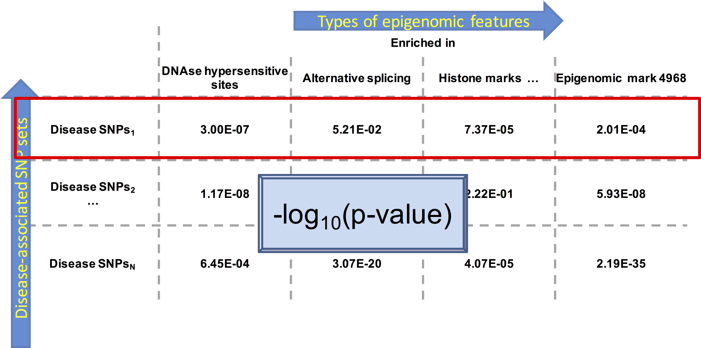</center>

## Epigenomic enrichment profiles {.larger}

$-log_{10}$-transformed epigenomic enrichment profiles can be compared using Spearman correlation

<center>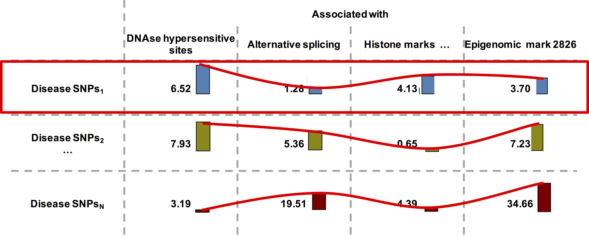</center>

## Comparing epigenomic enrichment profiles

PCA separates autoimmune disease-associated SNP sets as the most epigenomically distinct from others

<center></center>

## Comparing epigenomic enrichment profiles

tSNE separates autoimmune disease-associated SNP sets as the most epigenomically distinct from others

<center>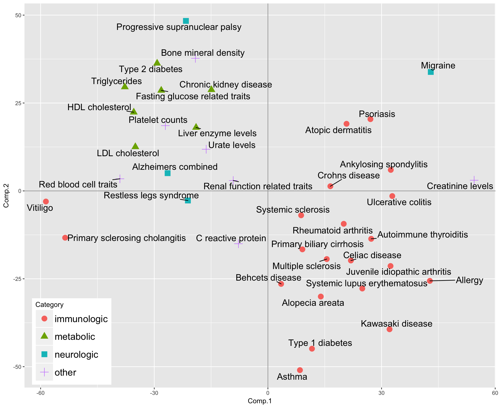</center>

## Validating epigenomic similarity {.larger}

- Shared loci vs. Literature Median Spearman = 0.46
- Shared loci vs. Disease Ontology Median Spearman = 0.30
- **Epigenomic similarity vs. Shared loci Median Spearman = 0.61**

<center></center>

<!--
## Comparing epigenomic enrichment profiles

<center></center>

## Validating epigenomic similarity

- **Shared loci** - Jaccard statistics
- **Semantic similarity** - minMim, misn, obsExp, relOverlap, sharedRels
- **Disease ontology similarity** - jiang, lin, rel, resnik, wang

<center></center>

-->

# Differential epigenomic analysis

## Differential epigenomic analysis

- Comparison of _multiple_ sets of genomic variants
- **Hypothesis** - some sets of genomic variants show consistently more/less significant enrichments

<center>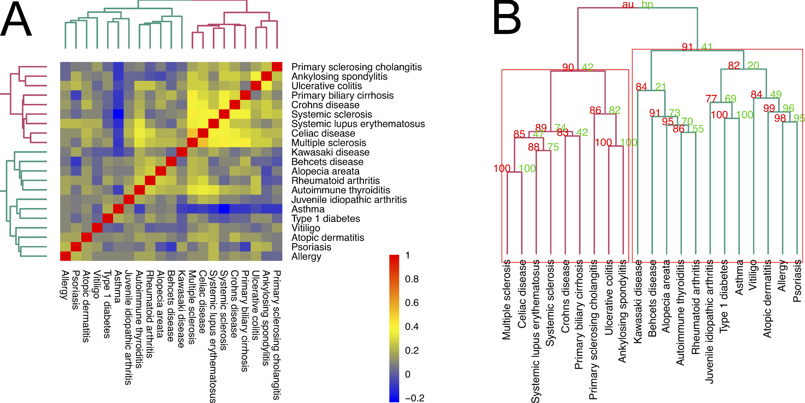</center>

## Differential epigenomic analysis | Why do we care {.larger}

- Better understanding of the regulatory mechanisms associated with subgroups of diseases

- Finer stratification of patients by the epigenomic differences associated with their genomes

- More precise treatment strategies

## Differential epigenomic analysis {.larger}

- Define two groups of SNP sets (use epigenomic similarity analysis)
- We are testing whether the _level_ of enrichment differs between groups of SNP sets

<center>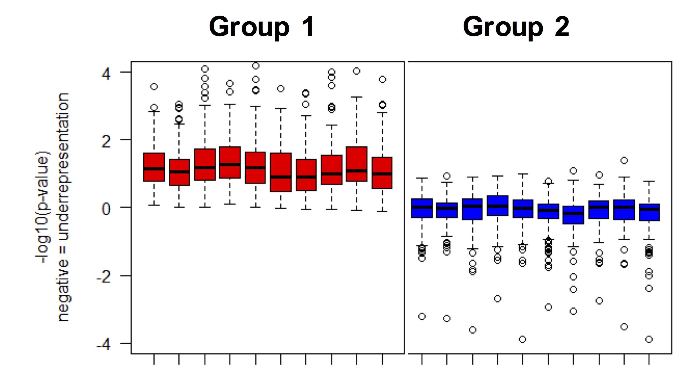</center>

## Differential epigenomic analysis {.larger}

**Quiescent chromatin states**, T helper cell-specific - enriched in disease SNPs in _red cluster_

**Enhancers**, T helper cell-specific  - enriched in disease SNPs in _green cluster_

<center>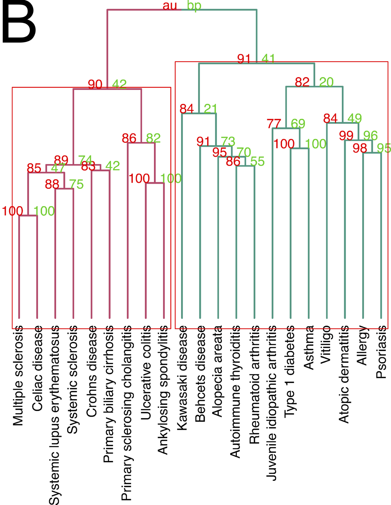</center>

<!--
# Cell type-specific epigenomic enrichment analysis

## Cell  type-specific epigenomic enrichment analysis {.larger}

- Epigenomic elements are cell- and tissue type specific

- **Hypothesis** - a SNP set is more likely to be enriched in epigenomic elements from cell types relevant to phenotype

- Cell type-specific epigenomic enrichment analysis identifies cell types where enrichments are the most significant

## Cell type-specific epigenomic enrichment analysis | Why do we care {.larger}

- More focused understanding of functional impact caused by SNPs

- Treatment of epigenomic abnormalities in relevant cell types

## Cell type-specific epigenomic enrichment analysis {.larger}

Detection of cell/tissue types with many regulatory marks enriched in SNPs

- Global distribution of enrichments - the null model
- Cell type-specific distribution of enrichments - the alternative model
- Test whether cell type-specific enrichments are significantly higher than the global level of enrichments

## Cell type specificity of the functional impact of disease SNPs is relevant to disease pathology {.larger}

- Alzheimer SNPs are enriched in brain-specific epigenomic marks

<center></center>
-->

# Personalized epigenomics

## Experimental setup {.larger}

- 431 patients diagnosed with Systemic Lupus Erythematosus (SLE)

- Exome sequencing - SNP sets

<!--
- Focus on rare variants - patient-specific SNP sets

## Why rare variants? {.larger}

- There is ~4 times more rare SNPs (MAF<5%) than common SNPs (MAF >5%)

<center></center>

<div style="font-size: small;">Nelson MR. et.al. "An Abundance of Rare Functional Variants in 202 Drug Target Genes Sequenced in 14,002 People" Science 2012, http://science.sciencemag.org/content/337/6090/100</div>

## Why rare variants? {.larger}

- Common SNPs are largely the same in healthy controls and SLE patients

- ~50% of rare SNPs are specific for either healthy controls, or SLE patients

<center></center>
-->

## Hypothesis {.larger}

- Patients may be diagnosed with the same disease, but have different underlying mechanisms

- Patient-specific SNP sets may have similar epigenomic enrichment profiles

- Patients can be classified by similarity of their epigenomic enrichment profiles

- Subgroups of patients having differential epigenomic enrichments may have different clinical outcomes

## Epigenomically distinct subgroups of patients

- Five subgroups of patients with distinct epigenomic enrichments

<center>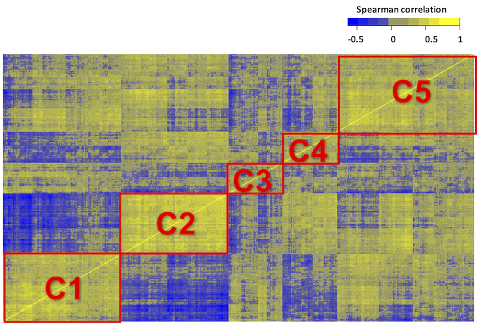</center>

## Differential clinical parameters

- Epigenomically distinct subgroups of patients also significantly differ by clinical attributes

<center>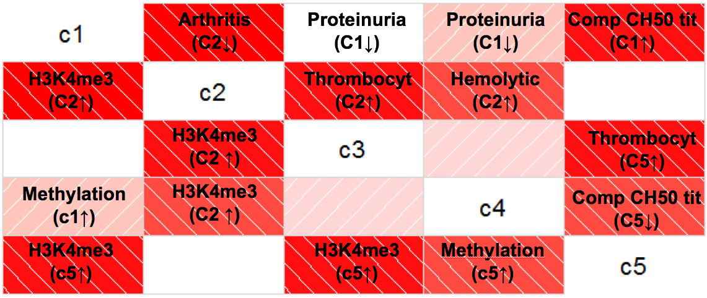</center>

## Summary {.larger}

- GenomeRunner defines potential functional impact of SNP sets via epigenomic enrichment analysis

- Epigenomic similarity analysis identifies regulatory similarity and differences among SNP sets

- Cell type-specific enrichment analysis prioritizes cell/tissue type specificity of the epigenomic enrichments

- Epigenomic enrichment analyses can be applied to any genomic signature, from disease-associated SNP sets to patient-specific genotypes


# What's next?

## Data integration {.larger}

**3D interaction data**

- Loops
- Topologically associated domains
- Stable/unstable 3D genomic regions
- Strongly interacting regions

**Clinical similarity data**

- Disease similarity data based on electronic medical records


## Enrichment methods development

```{r echo=FALSE, message=FALSE, fig.height=5, fig.width=7, cache=TRUE}
set.seed(3)
library(wordcloud)
acknowledgements <- c("EpiGraph", "EpiExplorer", "Genomic HyperBrowser", "Genomic Association Tester (GAT)", "PodBat", "EpiRegNet", "GREAT", "BEDTools", "GenometriCorr", "Genome Track Analyzer (AnCorr)", "ENCODE ChIP-Seq Significance Tool", "The Genboree Epigenome Toolset", "INRICH", "Enrichr", "BioMart Enrichment Tool", "fGWAS", "GoShifter", "FORGE", "ChIPSeeker", "LOLA", "regioneR", "GenomeRunner", "StereoGene")
frequency_of_acknowledgements <- rep(1, length(acknowledgements))
library(RColorBrewer)
pal2 <- brewer.pal(8,"Spectral")
wordcloud(words = acknowledgements, freq = frequency_of_acknowledgements, min.freq = 1, scale=c(2, 0), rot.per = 0, fixed.asp = FALSE, colors=pal2)
```

## Analysis: Population epigenomics {.larger}

- Busby, George (2016), “**Genotype data for a set of 163 worldwide populations**”, https://data.mendeley.com/datasets/ckz9mtgrjj/1
- 2,643 individuals from 163 worldwide human populations. 
- Epigenomic and 3D similarities and differences in population genome architecture

<center>

</center>

## Analysis: Personalized epigenomics {.larger}

- **TCGA** - 11,000 patients, 33 tumor types, 7 data types (genotypes, gene expression, methylation etc.). 
- Epigenomic classification of cancer subtypes
- Survival differences associated with patient-specific epigenomic signatures

<center>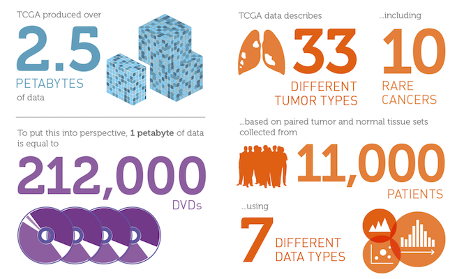</center>

## Analysis: Disease epigenomics {.larger}

- **GRASP2**: Genome-Wide Repository of Associations Between SNPs and Phenotypes
- 2,082 GWAS summary statistics at $p<0.05$.
- Epigenomic similarities and differences of complex diseases

<center>

</center>

<!--
# 3D epigenomics

## Genome in 3D {.larger}

- Genome is not linear - the spatial organization plays an important role in regulation of gene expression 
- Chromosome Conformation Capture sequencing technologies allow exploring long-range interactions and loop- and domain formation

<center>

</center>

<div style="font-size: small;">http://www.pnas.org/content/112/47/E6456.long</div>

## 3D chromatin organization {.larger}

- A/B compartments, lamina-associated domains (LADs)
- Topologically associated domains (TADs), sub-TADs
- Chromatin loops 

<center></center>

<div style="font-size: small;">Source: http://advances.sciencemag.org/content/1/11/e1500737</div>

## Long-range interactions {.larger}

- Long-range interactions compartmentalize a variety of regulatory elements to regulate gene expression
- Disruption of one or several of such interactions => gene expression changes => disease

<center></center>

## 3D changes are associated with diseases {.larger}

- Changes in 3D chromosome organization is an emerging hallmark of cancer

- Chromosome organization is thought to play a role in other diseases as well

- Disruption of 3D genomic structure can lead to changes in gene expression

## Hi-C technology

- Hi-C is a technique to capture long-range 3D genomic interactions across the whole genome
- Allows for the production of interaction matrices

<center>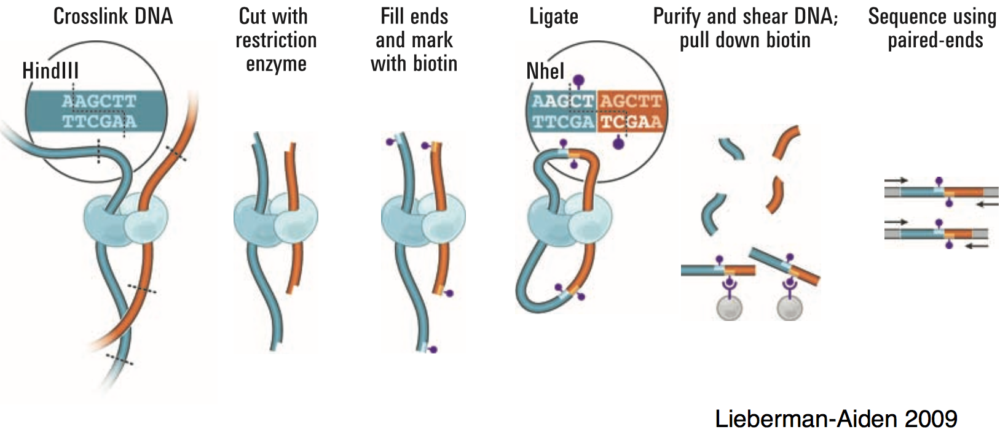</center>

## Chromatin interaction matrix

- Pairwise chromatin contact frequency
- Off-diagonal frequencies correspond to interactions at a given unit-distance

<center>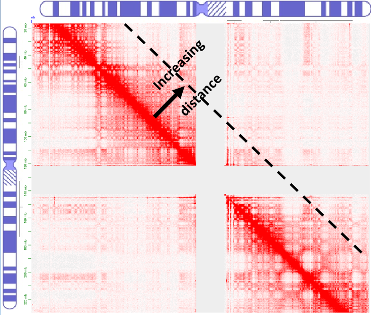</center>

## MD plot

- Visualizes differences between TWO chromatin interaction matrices
- A modification of MA plot, or Bland-Altman plot
- $M$ - difference between chromatin interactions, $log_2(IF_1/IF_2)$
- $D$ - unit distance

<center>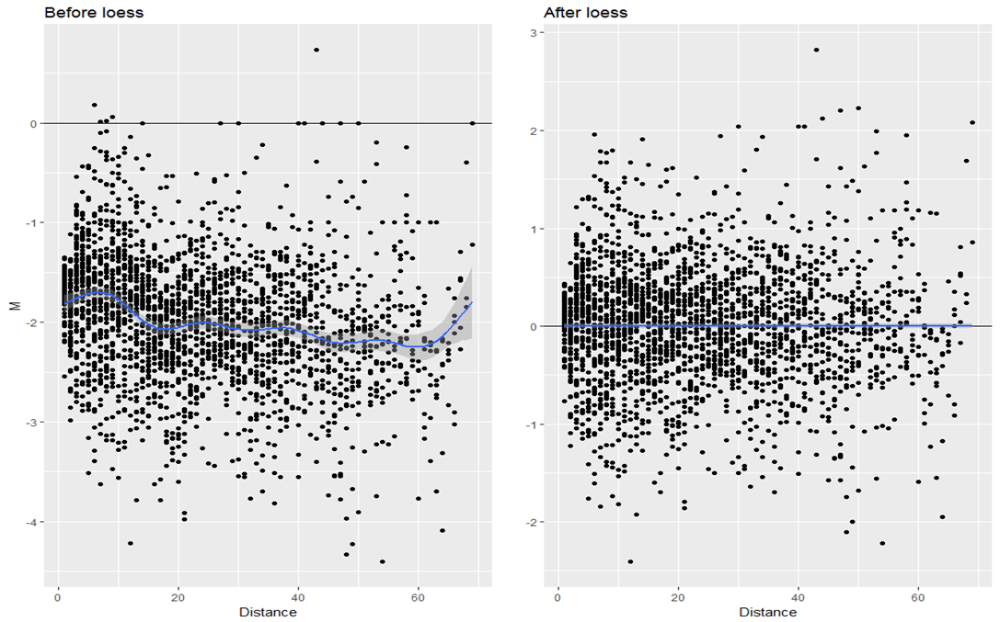</center>

## Biases in Hi-C data

- Genomic (CG content, chromatin accessibility etc.) and technical

- Normalization methods target individual Hi-C datasets (KR, ICE)

- Individually normalized datasets still contain biases

<center></center>

## Joint normalization {.larger}

- **Observations:** Chromatin organization is stable and highly conserved

- **Hypothesis:** the majority of chromatin contact should be unchanged

- **Solution:** build a rescaling model to minimize global differences

- **Solution:** _Loess_ - Locally weighted regression

## Detection of differential chromatin interactions {.larger}

- Bayesian method (Audic and Claverie, 1997)

$$p(y|x) = \frac{(x + y)!}{x! * y! * 2^{(x + y + 1)}}$$

## Detection of differential chromatin interactions {.larger}

- Bayesian method (Audic and Claverie, 1997)

$$p(y|x) = \frac{(x + y)!}{x! * y! * 2^{(x + y + 1)}}$$

- Per unit-distance permutation

$$ p_{M_{id}} = \frac{\sum_{k=1}^n{I(|m_k| \ge |M_{id}|)} + 1}{N + 1},$$

## Benchmarking {.larger}

- Simulate Hi-C data (Negative Binomial (signal) + Poisson (noise))

- Introduce controlled bias and _a priori_ known chromatin contact differences

- Normalize the datasets, either individually or jointly

- Detect differential chromatin contacts

- Assess power

## Benchmarking  ={.larger}

- Joint normalization is beneficial to detect small chromatin contact differences

<center>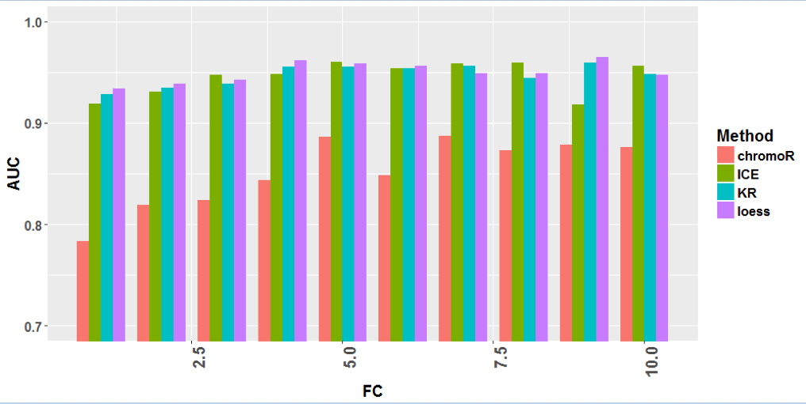</center>

## Future directions {.larger}

- **Comparative analysis:** tumor-normal 3D chromatin interactions; differences among brain regions

- **3D enrichment analysis:** detecting significant spatially co-localized chromatin regions

- **3D integromics:** consider the full spectrum of -omics data within the 3D structure of the genome

## Future directions

<center>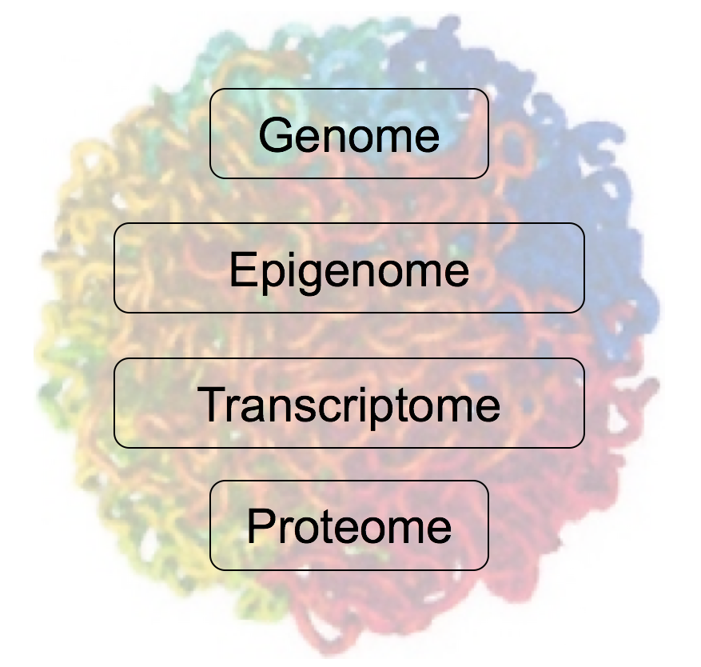</center>

> - "Everyone knew it was impossible, until a fool who didn't know came along and did it." _Albert Einstein_
-->


## Acknowledgement {.larger}

- Jonathan Wren, Oklahoma Medical Research Foundation
- Cory Giles, Oklahoma Medical Research Foundation
- Lukas Cara,  University of St. Thomas, Houston
- John Stansfield, Virginia Commonwealth Univrsity

&nbsp;

American Cancer Society Institutional Research Grant (ACS IRG)

## Thank you

&nbsp;

<div style="font-weight:bold; font-size: xx-large; text-align:center;">
Questions?
</div>

<center></center>

<div style="font-size: small;">
Mikhail Dozmorov, Ph.D.

Assistant professor, Department of Biostatistics, VCU

mikhail.dozmorov@vcuhealth.org 
</div>

