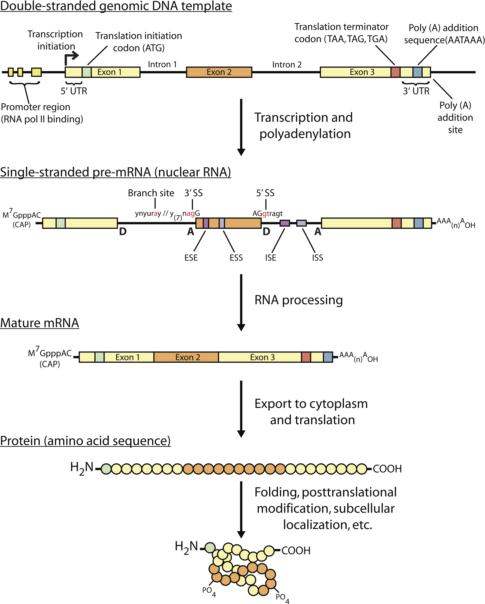
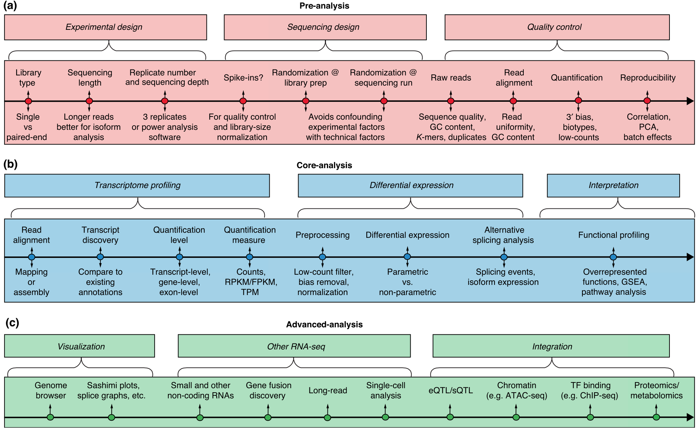
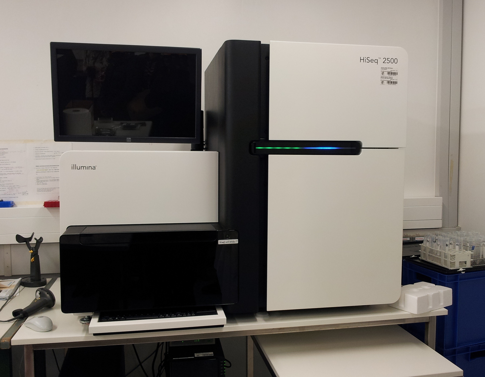
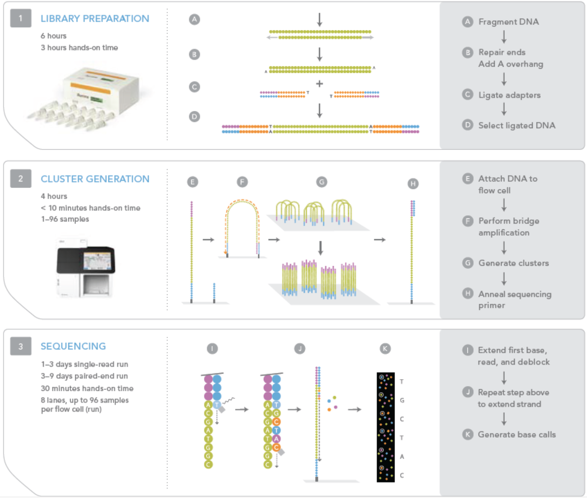
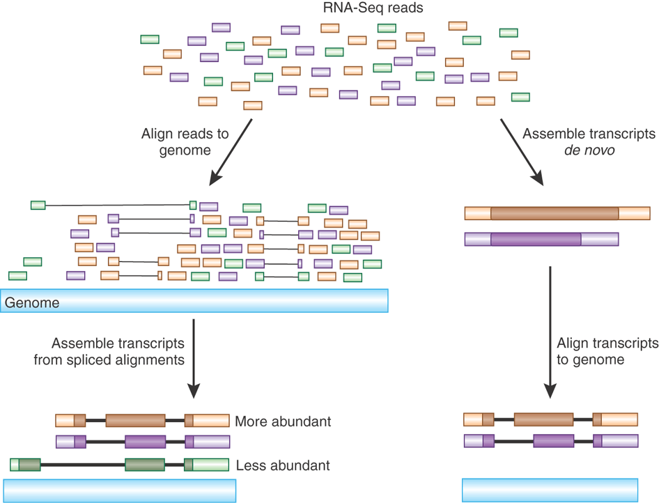
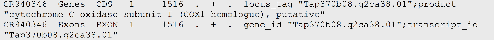
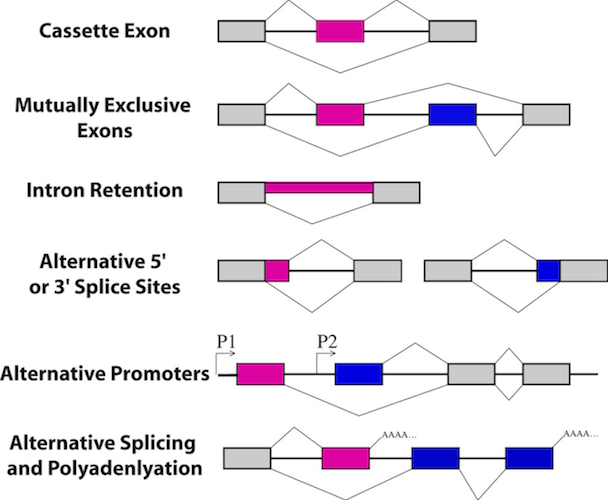

```{r setup, include=FALSE}
# Use 'verbatim = TRUE' as chunk option to show chunk code as is
require(knitr)
hook_source_def = knit_hooks$get('source')
knit_hooks$set(source = function(x, options){
  if (!is.null(options$verbatim) && options$verbatim){
    opts = gsub(",\\s*verbatim\\s*=\\s*TRUE\\s*", "", options$params.src)
    bef = sprintf('\n\n    ```{r %s}\n', opts, "\n")
    stringr::str_c(bef, paste(knitr:::indent_block(x, "    "), collapse = '\n'), "\n    ```\n")
  } else {
     hook_source_def(x, options)
  }
})
```

## Objectives {.larger}

Introduction to the theory and practice of RNA sequencing (RNA-seq) analysis

- Goals for RNA sequencing
- RNA-seq technology
- Experimental design
- RNA-seq analysis workflow
- Gene expression analysis
- Functional interpretation analysis
- Alternative splicing

# Goals for RNA sequencing

## Gene expression

<center></center>

<div style="font-size: small;">
Source: http://journals.plos.org/ploscompbiol/article?id=10.1371/journal.pcbi.1004393
</div>

## Why RNA-sequencing? {.larger}

- Gene Expression snapshot
- Allele-specific expression
- Transcriptome assembly
- Fusion detection
- Alternative splicing
- Detection of genomic variants

And many more, http://journals.plos.org/ploscompbiol/article/file?type=supplementary&id=info:doi/10.1371/journal.pcbi.1004393.s003

## Advantage of RNA-Seq over Microarray {.larger}

- Much richer information beyond quantitation
    - Boundary of gene transcripts: both 5' and 3' end, to nucleotide level 
    - Alternative exon usage, novel splicing junction detection
    - SNP/indel discovery in transcripts: both coding and UTRs
    - Allele specific expression: critical in imprinting, cancer

&nbsp;

- Not relying on gene annotation by mapping to the whole genome
    - No longer biased by probe design
    - Novel gene and exon discovery enabled

## Advantage of RNA-Seq over Microarray {.larger}

- Better performance at quantitation
    - Unlimited dynamic range: by increasing depth as needed
    - Higher specificity and accuracy: digital counts of transcript copies, very low background noise
    - Higher sensitivity: more transcripts and more differential genes detected

&nbsp;

- Re-analysis easily done by computation, as gene annotation keeps evolving 
- _De novo_ assembly possible, not relying on reference genome sequence 
- Comparable cost, continuing to drop

<!--
## RNA-seq pipeline

<center></center>

<div style="font-size: small;">
Source: https://github.com/Bioconductor/ENAR2016/blob/master/vignettes/Bioc-Intro.Rmd
</div>

## RNA-seq pipeline

<center></center>

<div style="font-size: small;">
Source: http://genomebiology.biomedcentral.com/articles/10.1186/s13059-016-0881-8
</div>
-->

# RNA-seq technology

## Sequencing technologies {.larger}

Commercially available

- Illumina/Solexa - short reads, sequencing-by-synthesis
- Life Technologies Ion Torrent/Proton - short reads, Ion Semiconductor sequencing
- Pacific Biosciences - long reads, Single Molecule Real Time sequencing

Experimental

- Nanopore sequencing - continuous sequencing (very long reads), fluctuations of the ionic current from nucleotides passing through the nanopore

## Sequencing technologies

<center></center>

- Specifications depend on the library preparation kits, Single or Dual flow cells, High-Output or Rapid-Run modes

## Sequencing technologies

- Example:
    - 100 bp paired-end reads
    - Dual Flow cell run-time
    - High-Output Run Mode
        - Up to 4 billion reads
        - 5 days run time
    - Rapid-Run Mode
        - Up to 600 million reads
        - 27 hours

<div style="font-size: small;">
Source: https://www.illumina.com/documents/products/datasheets/datasheet_hiseq2500.pdf
</div>

## Illumina sequencing workflow

<center></center>

<div style="font-size: small;">
Video: https://www.youtube.com/watch?v=77r5p8IBwJk
</div>

## Overview of RNA sequencing technology

<center></center>

<div style="font-size: small;">
Source: http://www.nature.com/nmeth/journal/v6/n11s/fig_tab/nmeth.1371_F5.html
</div>

## RNA-Seq Limitations {.larger}

- Quantitation influenced by many confounding factors
    - "Sequenceability" - varying across genomic regions, local GC content and structure related
    - Varying length of gene transcripts and exons
    - Bias in read ends due to reverse transcription, subtle but consistent 
    - Varying extent of PCR amplification artifacts
    - Effect of RNA degradation in the real world
    - Computational bias in aligning reads to genome due to aligners
    
## RNA-Seq Limitations {.larger}

- SNP discovery in RNA-seq is more challenging than in DNA
    - Varying levels of coverage depth
    - False discovery around splicing junctions due to incorrect mapping
    
- _De novo_ assembly of transcripts without genome sequence: computationally intensive but possible, technical improvements will help
    - longer read length
    - lower error rate
    - more uniform nucleotide coverage of transcripts - more equalized transcript abundance

## Library preparation {.larger}

- **RNA isolation**
    - $0.1-1\mu g$ original total RNA
- **Ribosomal RNA (rRNA) depletion**
    - rRNAs constitute over 90 % of total RNA in the cell, leaving the 1–2 % comprising messenger RNA (mRNA) that we are normally interested in.
    - Enriches for mRNA + long noncoding RNA. 
    - Hybridization to bead-bound rRNA probes

## Library preparation {.larger}

- **Poly(A) selection (for eukaryotes only)**
    - Enrich for mRNA.
    - Hybridization to oligo-dT beads
- **Small RNA extraction**
    - Specific kits required to retain small RNAs
    - Optionally, size-selection by gel

&nbsp;

<div style="font-size: small;">
More at http://journals.plos.org/ploscompbiol/article/file?type=supplementary&id=info:doi/10.1371/journal.pcbi.1004393.s006
</div>

## RNA quality

Agilent 2100 bioanalyzer. RIN - RNA integrity number (should be >7)

<center></center>

## Library preparation steps {.larger}

- **Fragmentation**, to recover short reads across full length of long genes
- **Size selection**, suitable for RNA sequencing. 300-500bp - mRNA, 20-150bp - small/miRNA
- **Amplification**, typically by PCR. Up to $0.5-10ng$ of RNA
- **Library normalization/Exome capture**

## Unstranded vs. Strand-specific library

**Unstranded**:  Random hexamer priming to reverse-transcribe mRNA

**Stranded**:  dUTP method - incorporating UTP nucleotides during the second cDNA synthesis, followed by digestion of the strand containing dUTP

<center></center>

<div style="font-size: small;">
More at http://journals.plos.org/ploscompbiol/article/file?type=supplementary&id=info:doi/10.1371/journal.pcbi.1004393.s007
</div>

## Library preparation steps {.larger}

- **Barcoding** and **multiplexing**
- Optionally, add **spike-in controls**
- **Single** or **paired end** sequencing. The latter is preferrable for _de novo_ transcript discovery or isoform expression analysis

&nbsp;

<div style="font-size: small;">
More at http://journals.plos.org/ploscompbiol/article/file?type=supplementary&id=info:doi/10.1371/journal.pcbi.1004393.s005
</div>

## Sequencing length/depth {.larger}

- Longer reads improve mappability and transcript quantification
- More transcripts will be detected and their quantification will be more precise as the sample is sequenced to a deeper level
- Up to 100 million reads is needed to precisely quantify low expressed transcripts. In reality, 20-30 million reads is OK for human genome.

## Overview of RNA sequencing technology

<center></center>

<div style="font-size: small;">
Source: http://journals.plos.org/ploscompbiol/article?id=10.1371/journal.pcbi.1004393
</div>

# Experimental design

## Experimental design {.larger}

- **Replication**. It allows the experimenter to obtain an estimate of the experimental error

- **Randomization**. It requires the experimenter to use a random choice of every factor that is not of interest but might influence the outcome of the experiment. Such factors are called nuisance factors

- **Blocking**. Creating homogeneous blocks of data in which a nuisance factor is kept constant while the factor of interest is allowed to vary. Used to increase the accuracy with which the influence of the various factors is assessed in a given experiment

- **Block what you can, randomize what you cannot**

## Experimental design {.larger}

In RNA-seq, we have multiple levels of randomness:

- Biological variability in samples
- Stochasticity of RNA content
- Randomness of fragments being sequenced
- Technical variability

&nbsp;

<div style="font-size: small;">
Auer, P.,RW Doerge. "Statistical Design and Analysis of RNA Sequencing Data." Genetics, 2010 http://www.genetics.org/content/185/2/405.long
</div>

## Experimental design: Multiplexing balances technical variability

<center></center>

## Number of replicates

Statistical power to detect differential expression varies with effect size, sequencing depth and number of replicates

| Replicates per group                 | 3    | 5    | 10    |
|--------------------------------------|------|------|-------|
| **Effect size (fold change)**            |      |      |       |
| 1.25                                 | 17 % | 25 % | 44 %  |
| 1.5                                  | 43 % | 64 % | 91 %  |
| 2                                    | 87 % | 98 % | 100 % |

&nbsp;

<div style="font-size: small;">
Source: http://genomebiology.biomedcentral.com/articles/10.1186/s13059-016-0881-8
</div>

## Number of replicates

Statistical power to detect differential expression varies with effect size, sequencing depth and number of replicates

| Replicates per group                 | 3    | 5    | 10    |
|--------------------------------------|------|------|-------|
| **Sequencing depth (millions of reads)** |      |      |       |
| 3                                    | 19 % | 29 % | 52 %  |
| 10                                   | 33 % | 51 % | 80 %  |
| 15                                   | 38 % | 57 % | 85 %  |

&nbsp;

<div style="font-size: small;">
Source: http://genomebiology.biomedcentral.com/articles/10.1186/s13059-016-0881-8
</div>

## Power calculations

- **Scotty**
    - Power Analysis for RNA Seq Experiments, http://scotty.genetics.utah.edu/

- **powerSampleSizeCalculator**
    - R scripts for power analysis and sample size estimation for RNA-Seq differential expression, http://www2.hawaii.edu/~lgarmire/RNASeqPowerCalculator.htm

- **RnaSeqSampleSize**
    - R package and a Shiny app for RNA sequencing data sample size estimation, https://cqs.mc.vanderbilt.edu/shiny/RNAseqPS/

<div style="font-size: small;">
Busby MA, Stewart C, Miller CA, Grzeda KR, Marth GT. "Scotty: a web tool for designing RNA-Seq experiments to measure differential gene expression". _Bioinformatics_ 2013 https://www.ncbi.nlm.nih.gov/pubmed/23314327

Travers C. et.al. "Power analysis and sample size estimation for RNA-Seq differential expression" _RNA_ 2014 https://www.ncbi.nlm.nih.gov/pmc/articles/PMC4201821/

Guo et.al. "RNAseqPS: A Web Tool for Estimating Sample Size and Power for RNAseq Experiment" _Cancer Informatics_ 2014 http://insights.sagepub.com/rnaseqps-a-web-tool-for-estimating-sample-size-and-power-for-rnaseq-ex-article-a4433
</div>

# RNA-seq analysis workflow

## FASTA/FASTQ format

**FASTA**: text-based representation of nucleotide sequence. http://zhanglab.ccmb.med.umich.edu/FASTA/

<center></center>

&nbsp;

**FASTQ**: sequence and quality info

<center></center>

## Quality control {.larger}

- **FASTQC** 
    - Quality of raw sequencing data, http://www.bioinformatics.babraham.ac.uk/projects/fastqc/
    - Video tutorial how to interpret, https://www.youtube.com/watch?v=bz93ReOv87Y

&nbsp;

- **RNASeQC** 
    - quality of mapped (aligned) data, http://rseqc.sourceforge.net/

## Quality of base calling {.larger}

- **Phred quality score** is widely used to characterize the quality of base calling
- Phred quality score = $-10*log_{10}(P)$, where P is probability that base-calling is wrong
- Phred score of 30 means there is 1/1000 chance that the base-calling is wrong
- The quality of the bases tend to drop at the end of the read, a pattern observed in sequencing-by-synthesis techniques

## Adapter trimming {.larger}

- **FASTX-Toolkit**: set of tools for low-level sequence trimming/cutting, http://hannonlab.cshl.edu/fastx_toolkit/
- **Trimmomatic**: well-documented and easy-to-use adapter trimmer using multiple algorithms. Handles single- and paired-end reads. http://www.usadellab.org/cms/?page=trimmomatic
- **Flexbar**: similar to Trimmomatic by functionality. https://github.com/seqan/flexbar/wiki/Manual

## Alignment {.larger}

- RNA-seq aligners face an additional problem, not encountered in DNA-only alignment: many RNA-seq reads will span introns
- The average human intron length is >6,000 bp (some are >1 Mbp in length)
- In a typical human RNA-seq experiment using 100-bp reads, >35% of the reads will span multiple exons - align over splice junctions
- Aligners must be splice-aware, especially when aligning longer (>50bp) reads

## Duplicates removal {.larger}

- Duplicates may correspond to biased PCR amplification of particular fragments
- For highly expressed, short genes, duplicates are expected even if there is no amplification bias
- Removing them may reduce the dynamic range of expression estimates

Generally, do not remove duplicates from RNA-seq data

- If you ultimately want to remove duplicates, use Picard tools' `MarkDuplicates` command, https://broadinstitute.github.io/picard/command-line-overview.html#MarkDuplicates

## Alignment strategies

<center></center>

Align to the reference genome is the most common for transcript quantification

## Alignment - Mapping RNA-seq reads to the genome

- **BWA**: general purpose algorithms tuned for different tasks, http://bio-bwa.sourceforge.net/
- **STAR**: fast and accurate aligner, https://github.com/alexdobin/STAR
- **HISAT**: (hierarchical indexing for spliced alignment of transcripts) uses two types of indexes for alignment: a global, whole-genome index and tens of thousands of small local indexes. Can detect novel splice sites, transcription initiation and termination sites. A part of the new "Tuxedo suite", including StringTie and Ballgown, http://ccb.jhu.edu/software/hisat2/index.shtml.
- **subread**: a fast and accurate aligner, R and command line. The whole package includes `subjunc` for junction detection, and `featureCounts` for extracting read counts per gene from aligned SAM/BAM files, http://subread.sourceforge.net/

<div style="font-size: small;">
Timeline and extensive comparison of aligners: https://www.ebi.ac.uk/~nf/hts_mappers/
</div>

## SAM format of aligned data

– SAM stands for Sequence Alignment/Map format. The SAM format consists of two sections: 

**Header section**

- Used to describe source of data, reference sequence, method of alignment, etc.

**Alignment section**

- Used to describe the read, quality of the read, and nature alignment of the read to a region of the genome

SAM format specification https://samtools.github.io/hts-specs/SAMv1.pdf

## BAM file format of aligned data

- BAM is the binary version of a SAM file. Smaller, but not easily readable.
- Compressed using lossless BGZF format
- Other BAM compression strategies are a subject of research. See ‘CRAM’ format for example, http://www.internationalgenome.org/faq/what-are-cram-files/

- BAM files are usually indexed. An index is stored alongside the BAM file with a ".bai" extension
- Indexing aims to achieve fast retrieval of alignments overlapping a specified region without going through the whole alignments.
- BAM must be sorted before indexing. Depending on the downstream tools, sort by 
    - Name
    - Coordinate

## SAM/BAM header section

- Used to describe source of data, reference sequence, method of alignment, etc.
- Each section begins with character ‘@’ followed by a two-letter record type code. These are followed by two-letter tags and values

```
@HD The header line
VN: format version
SO: Sorting order of alignments
@SQ Reference sequence dictionary
SN: reference sequence name
LN: reference sequence length
SP: species
@RG Read group
ID: read group identifier
CN: name of sequencing center
SM: sample name
@PG Program
PN: program name
VN: program version
```

## SAM/BAM alignment section

<center></center>

&nbsp;

<div style="font-size: small;">
Source: https://samtools.github.io/hts-specs/SAMv1.pdf
</div>

## Using SAM flags to filter subsets of reads

- 12 bitwise flags describing the alignment
- These flags are stored as a binary string of length 11
- Value of ‘1’ indicates the flag is set. e.g. 00100000000
- All combinations can be represented as a number from 1 to 2048 (i.e. $2^{11}-1$). This number is used in the
BAM/SAM file. You can specify "required" or "filter" flags in samtools view using the '-f' and '-F' options, respectively
- https://broadinstitute.github.io/picard/explain-flags.html

<center></center>

<div style="font-size: small;">
Source: https://samtools.github.io/hts-specs/SAMv1.pdf
</div>

## CIGAR string

<center></center>

- The CIGAR string is a sequence of base lengths and associated "operations" that are used to indicate which bases align to the reference (either a match or mismatch), are deleted, are inserted, represent introns, etc.
    - e.g. 81M859N19M
    - Read as: A 100 bp read consists of: 81 bases of alignment to reference, 859 bases skipped (an intron), 19 bases of alignment

<div style="font-size: small;">
Source: https://samtools.github.io/hts-specs/SAMv1.pdf
</div>

## Browser Extensible Data (BED) format

- When working with BAM files, it is very common to want to examine reads aligned to a focused subset of the reference genome, e.g. the exons of a gene
- Focus on location - genomic coordinates
- Basic BED format (plain text, tab separated):
- Chromosome name, start position, end position 
- Coordinates in BED format are 0 based

https://genome.ucsc.edu/FAQ/FAQformat#format1

## GFF/GTF file format

- Generic feature format for storing genomic annotation data. 
- Tab delimited text file (with optional header lines beginning ##):
    - contig (chromosome)
    - source
    - type
    - start
    - end
    - score
    - strand
    - phase
    - attributes

<center></center>

<div style="font-size: small;">
GFF specifications: https://github.com/The-Sequence-Ontology/Specifications/blob/master/gff3.md

More about file formats, http://journals.plos.org/ploscompbiol/article/file?type=supplementary&id=info:doi/10.1371/journal.pcbi.1004393.s008
</div>

## Tools to work with SAM/BAM/BED files

SAM/BAM files 

- `samtools`, view, sort, index, QC, stats on SAM/BAM files, and more, https://github.com/samtools/samtools
- `sambamba`, view, sort, index, merge, stats, mark duplicates. fast laternative to `samtools`, https://lomereiter.github.io/sambamba/index.html
- `picard`, QC, validation, duplicates removal and many more utility tools, https://broadinstitute.github.io/picard/

BED files 

- `bedtools`, universal tools for manipulating genomic regions, https://bedtools.readthedocs.io/en/latest/
- `bedops`, complementary to `bedtools`, providing additional functionality and speedup, https://bedtools.readthedocs.io/en/latest/

## Visualization

Integrative Genomics Viewer (IGV), http://software.broadinstitute.org/software/igv/

<center></center>

## IGV {.larger}
 
Features

- Explore large genomic datasets with an intuitive, easy-to-use interface.
- Integrate multiple data types with clinical and other sample information.
- View data from multiple sources:
    - local, remote, and "cloud-based".
    - Intelligent remote file handling - no need to download the whole dataset
- Automation of specific tasks using command-line interface

- Tutorial: https://github.com/griffithlab/rnaseq_tutorial/wiki/IGV-Tutorial

# Gene expression analysis

## Expression estimation for known genes and transcripts

**HTSeq** (htseq-count), http://www-huber.embl.de/HTSeq/doc/count.html

- `htseq-count --mode intersec=on-strict --stranded no --minaqual 1 --type exon --ida_r transcript_id accepted_hits.sam chr22.gff > transcript_read_counts_table.tsv`
- Issues with `htseq-count`: http://seqanswers.com/forums/showthread.php?t=18068

**featureCounts**, http://bioinf.wehi.edu.au/featureCounts/

- Summarize multiple datasets at the same time:
- `featureCounts -t exon -g gene_id -a annotation.gtf -o counts.txt library1.bam library2.bam library3.bam`

## Expression estimation for known genes and transcripts

- **Counts of reads**: The relative expression of a transcript is proportional to the number of cDNA fragmets that originate from it ~ number of aligned reads. Disadvantages: longer gene produce more reads, library depth (total counts) influence counts of individual transcripts
- **Counts per million**: counts scaled by the library depth in million units. $CPM=C * 10^6 / N$
- **RPKM**: Reads Per Kilobase of transcript per Million mapped reads.
- **FPKM**: Fragments Per Kilobase of transcript per Million mapped reads.

## Expression estimation for known genes and transcripts

- **FPKM** (or **RPKM**) attempt to normalize for gene size and library depth

$$RPKM\ (or\ FPKM)=(10^9*C)/(N*L)$$

- $C$ - number of mappable reads/fragments for a gene/transcript/exon/etc.
- $N$ - total number of mappable reads/fragments in the library
- $L$ - number of base pairs in the gene/transcript/exon/etc.

- **RSEM**: RNA-Seq by Expectation-Maximization, https://www.ncbi.nlm.nih.gov/pubmed/21816040

&nbsp;

https://haroldpimentel.wordpress.com/2014/05/08/what-the-fpkm-a-review-rna-seq-expression-units/

## TPM: Transcript per Kilobase Million

**FPKM is calculated as**

1. Sum sample/library fragments per million
2. Divide gene/transcript fragment counts by #1 –  fragments per million, FPM
3. Divide FPM by length of gene in kilobases (FPKM)

**TPM reverses the order - length first, library size second**

1. Divide fragment count by length of transcript –  fragments per kilobase, FPK
2. Sum all FPK for sample/library per million
3. Divide #1 by #2 (TPM)

- http://www.rna-seqblog.com/rpkm-fpkm-and-tpm-clearly-explained/

- https://www.ncbi.nlm.nih.gov/pubmed/22872506

## Scripts for RNA-seq data analysis

- https://github.com/mdozmorov/dcaf/tree/master/ngs.rna-seq - an example of a pipeline
- https://github.com/chapmanb/bcbio-nextgen - Validated, scalable, community developed variant calling, RNA-seq and small RNA analysis https://bcbio-nextgen.readthedocs.org


## Batch effects {.larger}

- Batch effects are widespread in high-throughput biology. They are artifacts not related to the biological variation of scientific interests. 

- For instance, two experiments on the same technical replicates processed on two different days might present different results due to factors such as room temperature or the two technicians who did the two experiments. 

- Batch effects can substantially confound the downstream analysis, especially meta-analysis across studies. 

## Batch sources

<center>

</center>

## ComBat {.larger}

**ComBat - Location-scale method**

The core idea of ComBat was that the observed measurement $Y_{ijg}$ for the expression value of gene $g$ for sample $j$ from batch $i$ can be expressed as 

$$Y_{ijg}=\alpha_g+X\beta_g+\gamma_{ig}+\delta_{ig}\epsilon_{ijg}$$

where $X$ consists of covariates of scientific interests, while $\gamma_{ig}$ and $\delta_{ig}$ characterize the additive and multiplicative batch effects of batch $i$ for gene $g$. 

https://www.bu.edu/jlab/wp-assets/ComBat/Abstract.html

## ComBat {.larger}

After obtaining the estimators from the above linear regression, the raw data $Y_{ijg}$ can be adjusted to $Y_{ijg}^*$:

$$Y_{ijg}^*=\frac{Y_{ijg}-\hat{\alpha_g}-X\hat{\beta_g}-\hat{\gamma_{ig}}}{\hat{\delta_{ig}}}+\hat{\alpha_g}+X\hat{\beta_g}$$

For real application, an empirical Bayes method was applied for parameter estimation. 

https://www.bu.edu/jlab/wp-assets/ComBat/Abstract.html

## SVA {.larger}

When batches were unknown, the surrogate variable analysis (SVA) was developed. 

The main idea was to separate the effects caused by covariates of our primary interests from the artifacts not modeled.

Now the raw expression value $Y_{jg}$ of gene $g$ in sample $j$ can be formulated as:

$$Y_{jg}=\alpha_g+X\beta_g+\sum_{k=1}^K{\lambda_{kg}\eta_{kj}}+\epsilon_{jg}$$

where $\eta_{kj}$s represent the unmodeled factors and are called as “surrogate variables”. 

## SVA {.larger}

Once again, the basic idea was to estimate $\eta_{kj}$s and adjust them accordingly. 

An iterative algorithm based on singular value decomposition (SVD) was derived to iterate between estimating the main effects $\hat{\alpha_g}+X\hat{\beta_g}$ given the estimation of surrogate variables and estimating surrogate variables from the residuals $r_{jg}=Y_{jg}-\hat{\alpha_g}-X\hat{\beta_g}$

## `sva` package in Bioconductor {.larger}

- Contains `ComBat` function for removing effects of known batches. 
- Assume we have:
    * `edata`: a matrix for raw expression values 
    * `batch`: a vector named for batch numbers. 

```{r eval=FALSE}
modcombat = model.matrix(~1, data=as.factor(batch)) 

combat_edata = ComBat(dat=edata, batch=batch, mod=modcombat, par.prior=TRUE, prior.plot=FALSE)
```

https://bioconductor.org/packages/release/bioc/html/sva.html

## SVASEQ {.larger}

For sequencing data, `svaseq`, the generalized version of SVA, suggested applying a moderated log transformation to the count data or fragments per kilobase of exon per million fragments mapped (FPKM) first to account for the nature of discrete distributions 

Instead of a direct transformation on the raw counts or FPKM, remove unwanted variation (RUV) adopted a generalized linear model for $Y_{jg}$ 

## BatchQC - Batch Effects Quality Control {.larger}

A Bioconductor package with a GUI (shiny app).

https://github.com/mani2012/BatchQC

## Differential expression analysis {.larger}

- Many tools for differential expression analysis design their statistics around raw read counts
- Poisson distribution (single-parameter model, mean = variance)?
- Genes with larger average expression (counts) have on average larger variance across samples.
- Negative Binomial is a good approximation, https://www.ncbi.nlm.nih.gov/pubmed/23975260
- Variability is modeled by the dispersion parameter

## Differential expression analysis {.larger}

- `DESeq2` - https://bioconductor.org/packages/release/bioc/html/DESeq.html, https://genomebiology.biomedcentral.com/articles/10.1186/s13059-014-0550-8
- `edgeR` - https://bioconductor.org/packages/release/bioc/html/edgeR.html, https://academic.oup.com/bioinformatics/article-lookup/doi/10.1093/bioinformatics/btp616

&nbsp;

- Both use Negative Binomial distribution
- Differ in estimation of the dispersion parameter

## Differential expression analysis

- `limma` - Linear Models for Microarray Data, https://bioconductor.org/packages/release/bioc/html/limma.html
- `voom` - variance modeling at the observational level transformation. Uses the variance of genes to create weights for use in linear models. https://genomebiology.biomedcentral.com/articles/10.1186/gb-2014-15-2-r29

&nbsp;

- After `voom` transformation, the RNA-seq data can be analyzed using `limma`. 
- https://gist.github.com/mdozmorov/fb7a1f40eb18699298442c3e77a0de02 - Differential expression analysis in RNA-seq, short
- https://gist.github.com/stephenturner/e34e32b3d054bb850ae2 - Differential expression analysis in RNA-seq, long

# Functional interpretation analysis

## Interpretation {.larger}

- **Enrichment analysis** - high-level understanding of the biology behind hundreds differentially expressed genes
- **Gene annotations** - sets of genes with shared functions, or structured _a priori_knowledge about genes. Gene Ontology (http://geneontology.org/), MSigDb (http://software.broadinstitute.org/gsea/msigdb/) and MSigDf (https://github.com/stephenturner/msigdf), KEGG pathways (http://www.genome.jp/kegg/) and many more.

## Enrichment analysis, Hypergeometric test {.larger}

- $m$ is the total number of genes
- $j$ is the number of genes are in the functional category
- $n$ is the number of differentially expressed genes
- $k$ is the number of differentially expressed genes in the category

<center></center>

## Enrichment analysis, Hypergeometric test {.larger}

- $m$ is the total number of genes
- $j$ is the number of genes are in the functional category
- $n$ is the number of differentially expressed genes
- $k$ is the number of differentially expressed genes in the category

The expected value of $k$ would be $k_e=(n/m)*j$. 

If $k > k_e$, functional category is said to be enriched, with a ratio of enrichment $r=k/k_e$

## Enrichment analysis, Hypergeometric test {.larger}

- $m$ is the total number of genes
- $j$ is the number of genes are in the functional category
- $n$ is the number of differentially expressed genes
- $k$ is the number of differentially expressed genes in the category

|                    | Diff. exp. genes | Not Diff. exp. genes | Total |
|--------------------|:----------------:|:--------------------:|:------|
| In gene set        |        k         |           j-k        | j     |
| Not in gene set    |       n-k        |         m-n-j+k      | m-j   |
| Total              |       n          |           m-n        |  m    |

## Enrichment analysis, Hypergeometric test {.larger}

- $m$ is the total number of genes
- $j$ is the number of genes are in the functional category
- $n$ is the number of differentially expressed genes
- $k$ is the number of differentially expressed genes in the category

What is the probability of having $k$ or more genes from the category in the selected $n$ genes?

$$P = \sum_{i=k}^n{\frac{\binom{m-j}{n-i}\binom{j}{i}}{{m \choose n}}}$$

## Enrichment analysis, Hypergeometric test {.larger}

- $m$ is the total number of genes
- $j$ is the number of genes are in the functional category
- $n$ is the number of differentially expressed genes
- $k$ is the number of differentially expressed genes in the category

$k < (n/m)*j$ - underrepresentation. Probability of $k$ or less genes from the category in the selected $n$ genes?

$$P = \sum_{i=0}^k{\frac{\binom{m-j}{n-i}\binom{j}{i}}{{m \choose n}}}$$

## Enrichment analysis, Hypergeometric test {.larger}

1. Find a set of differentially expressed genes (DEGs)
2. Are _DEGs in a set_ more common than _DEGs not in a set_?

- Fisher test `stats::fisher.test()`
- Conditional hypergeometric test, to account for directed hierachy of GO `GOstats::hyperGTest()`

&nbsp;

Example: https://github.com/mdozmorov/MDmisc/blob/master/R/gene_enrichment.R

## Problems with Fisher's exact test {.larger}

- The outcome of the overrepresentation test depends on the significance threshold used to declare genes differentially expressed. 

- Functional categories in which many genes exhibit small changes may go undetected. 

- Genes are not independent, so a key assumption of the Fisher’s exact tests is violated.

## Many GO enrichment tools {.larger}

- **GOStat**, http://gostat.wehi.edu.au/
- **GOrilla**, Gene Ontology enRIchment anaLysis and visuaLizAtion tool http://cbl-gorilla.cs.technion.ac.il/
- **g:Profiler**, http://biit.cs.ut.ee/gprofiler/
- **Metascape**, http://metascape.org/
- **ToppGene**, https://toppgene.cchmc.org/
- **WebGestalt** - WEB-based GEne SeT AnaLysis Toolkit, http://www.webgestalt.org/
- R packages, **clusterProfiler**, https://www.bioconductor.org/packages/devel/bioc/html/clusterProfiler.html

## Enrichment analysis, Functional Class Scoring (FCS) {.larger}

- **Gene set analysis (GSA)**. Mootha et al., 2003; modified by Subramanian, et al. "**Gene set enrichment analysis: A knowledge-based approach for interpreting genome-wide expression profiles.**" PNAS 2005 http://www.pnas.org/content/102/43/15545.abstract

- Main rationale – functionally related genes often display a coordinated expression to accomplish their roles in the cells

- Aims to identify gene sets with "subtle but coordinated"  expression changes that would be missed by DEGs threshold selection

## GSEA: Gene set enrichment analysis {.larger}

- The null hypothesis is that the **rank ordering** of the genes in a given comparison is **random** with regard to the case-control assignment.

- The alternative hypothesis is that the **rank ordering** of genes sharing functional/pathway membership is **associated** with the case-control assignment.

## GSEA: Gene set enrichment analysis

1. Sort genes by log fold change
2. Calculate running sum - increment when gene in a set, decrement when not
3. Maximum of the runnig sum is the enrichment score - larger means genes in a set are toward top of the sorted list
4. Permute subject labels to calculate significance p-value

<center>

</center>

## Other approaches {.larger}

**Linear model-based**

- **CAMERA** (Wu and Smyth 2012)
- **C**orrelation-**A**djusted **ME**an **RA**nk gene set test
- Estimating the variance inflation factor associated with inter-gene correlation, and incorporating this into parametric or rank-based test procedures

## Other approaches {.larger}

**Linear model-based**

- **ROAST** (Wu et.al. 2010)
- Under the null hypothesis (and assuming a linear model) the residuals are independent and identically distributed $N(0,\sigma_g^2)$.
- We can _rotate_ the residual vector for each gene in a gene set, such that gene-gene expression correlations are preserved.


## Genome analysis platform: Galaxy {.larger}

- Open Source academic project, https://usegalaxy.org/
- A web-based user-friendly interface that allows you to run existing workflows or create custom analyses by combining tools in the Galaxy 'toolshed'
- Example of RNA-seq workflow: https://usegalaxy.org/workflow/display_by_username_and_slug?username=mwolfien&slug=rnaseq-wolfien-pipeline

List of other genome analysis plaforms - https://docs.google.com/spreadsheets/d/1o8iYwYUy0V7IECmu21Und3XALwQihioj23WGv-w0itk/pubhtml

## Alternative splicing

<center></center>

## Alternative splicing

<center></center>

<div style="font-size: small;">
Alamancos, G. et.al. "Methods to Study Splicing from High-Throughput RNA Sequencing Data." _Spliceosomal Pre-mRNA Splicing: Methods and Protocols_, 2014 https://www.ncbi.nlm.nih.gov/pubmed/24549677
</div>

## Alternative splicing

Best approach to predict novel and alternative splicing events from RNA-seq data

- https://www.biostars.org/p/68966/
- https://www.biostars.org/p/62728/

Alternative splicing detection

- https://www.biostars.org/p/65617/
- https://www.biostars.org/p/11695/

Identifying genes that express different isoforms in cancer vs normal RNA-seq data

- https://www.biostars.org/p/50365/

Visualization of alternative splicing events using RNA-seq data

- https://www.biostars.org/p/8979/

## References

- Griffith, M. et.al. "Informatics for RNA Sequencing: A Web Resource for Analysis on the Cloud." _PLoS Computational Biology_ 2015 - RNA-seq overview and extensive supplementary material http://journals.plos.org/ploscompbiol/article?id=10.1371/journal.pcbi.1004393. The complete practical RNA-seq tutorial https://github.com/griffithlab/rnaseq_tutorial

- Conesa, A. et.al. "A Survey of Best Practices for RNA-Seq Data Analysis."" _Genome Biology_ 2016. http://genomebiology.biomedcentral.com/articles/10.1186/s13059-016-0881-8

- Law, C. et.al. "RNA-Seq Analysis Is Easy as 1-2-3 with Limma, Glimma and edgeR." _F1000Research_ 2016. - Latest Rsubread-limma plus pipeline https://f1000research.com/articles/5-1408/v2. The complete R code for RNA-seq analysis tutorial https://www.bioconductor.org/help/workflows/RNAseq123/

## References

- Pertea, M. et.al. “Transcript-Level Expression Analysis of RNA-Seq Experiments with HISAT, StringTie and Ballgown.” _Nature Protocols_ 2016. http://www.nature.com/nprot/journal/v11/n9/full/nprot.2016.095.html

- Williams, A. et.al. "RNA-Seq Data: Challenges in and Recommendations for Experimental Design and Analysis: RNA-Seq Data: Experimental Design and Analysis." 2014. http://onlinelibrary.wiley.com/doi/10.1002/0471142905.hg1113s83/abstract

- Tools for RNA-seq data analysis, http://journals.plos.org/ploscompbiol/article/file?type=supplementary&id=info:doi/10.1371/journal.pcbi.1004393.s004


## Thank you

&nbsp;

<div style="font-weight:bold; font-size: xx-large; text-align:center;">
Questions?
</div>

&nbsp;

<div style="text-align: center;">
This presentation on GitHub: 

<https://github.com/mdozmorov/presentations>
</div>

&nbsp;

<div style="font-size: small;">
Mikhail Dozmorov, Ph.D.

Assistant professor, Department of Biostatistics, VCU

mikhail.dozmorov@vcuhealth.org 
</div>