## Overview {.larger}

- Why enrichment analysis?
- What is enrichment analysis?
- Gene ontology and pathways
- GENE ontology and pathways enrichment
- Multiple testing correction
- GENOMIC REGIONS enrichment
- Tools and references

## Overview {.larger}

- **Why enrichment analysis?**
- <div style="color: #808080">What is enrichment analysis?</div>
- <div style="color: #808080">Gene ontology and pathways</div>
- <div style="color: #808080">GENE ontology and pathways enrichment</div>
- <div style="color: #808080">Multiple testing correction</div>
- <div style="color: #808080">GENOMIC REGIONS enrichment</div>
- <div style="color: #808080">Tools and references</div>

## Why enrichment analysis?  {.larger}

- Human genome contains ~20,000-25,000 genes
- Each gene has multiple functions
- If 1,000 genes have changed in an experimental condition, it may be difficult to understand what they do

<center>
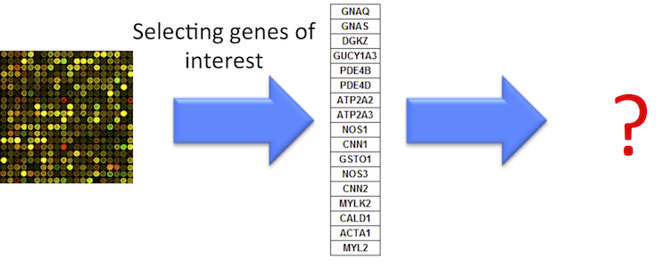
</center>

## Birds of a feather flock together {.larger}

- Genes with similar expression patterns share similar functions
- Similar (common) functions characterize a group of genes

<center>

</center>

## Birds of a feather flock together {.larger}

- Genes with similar expression patterns share similar functions
- Similar (common) functions characterize a group of genes

<center>

</center>

&nbsp;

- People with similar genetic patterns are likely friends

- Christakis NA, Fowler JH. "Friendship and natural selection." PNAS 2014 [https://www.ncbi.nlm.nih.gov/pubmed/25024208](https://www.ncbi.nlm.nih.gov/pubmed/25024208)

## Why enrichment analysis?  {.larger}

- High level understanding of the biology behind gene expression – **Interpretation!**
- Translating changes of hundreds/thousands of differentially expressed genes into a few biological processes (reducing dimensionality)

<center>
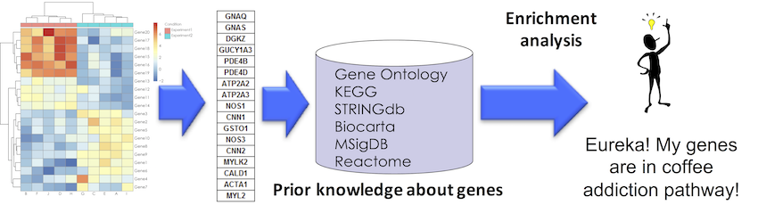
</center>

## Overview {.larger}

- <div style="color: #808080">Why enrichment analysis?</div>
- **What is enrichment analysis?**
- <div style="color: #808080">Gene ontology and pathways</div>
- <div style="color: #808080">Enrichment analysis</div>
- <div style="color: #808080">GENE ontology and pathways enrichment</div>
- <div style="color: #808080">GENOMIC REGIONS enrichment</div>
- <div style="color: #808080">Tools and references</div>

## What is enrichment analysis {.larger}

- **Enrichment analysis** - summarizing common functions associated with a group of objects

<center>
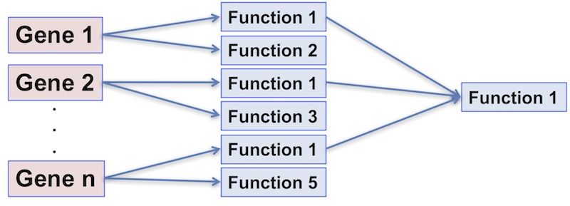
</center>

## What is enrichment analysis? – statistical definition {.larger}

**Enrichment analysis** – detection whether a group of objects has certain properties more (or less) frequent than can be expected by chance

<center>
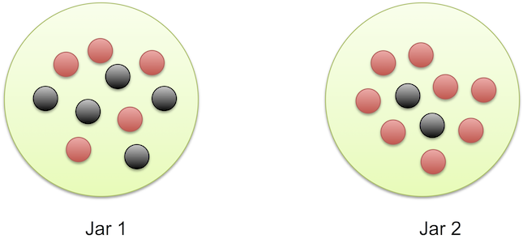
</center>

## Classification of genes {.larger}

**Gene set** - _a priori_ classification of genes into biologically relevant groups (sets)

- Members of the same biochemical pathways
- Genes annotated with the same molecular function
- Transcripts expressed in the same cellular compartments
- Co-regulated/co-expressed genes
- Genes located on the same cytogenetic band
- ...

## Overview {.larger}

- <div style="color: #808080">Why enrichment analysis?</div>
- <div style="color: #808080">What is enrichment analysis?</div>
- **Gene ontology and pathways**
- <div style="color: #808080">GENE ontology and pathways enrichment</div>
- <div style="color: #808080">Multiple testing correction</div>
- <div style="color: #808080">GENOMIC REGIONS enrichment</div>
- <div style="color: #808080">Tools and references</div>

## Annotation databases and ontologies

- An annotation database annotates genes with functions or properties - sets of genes with shared functions
- Structured prior knowledge about genes

<center>
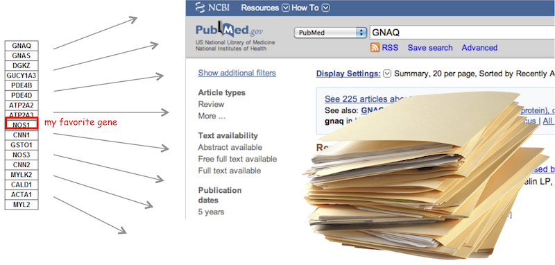
</center>

## Gene ontology {.larger}

- An ontology is a formal (hierarchical) representation of concepts and the relationships between them.

- The objective of GO is to provide controlled vocabularies of terms for the description of gene products.

- These terms are to be used as attributes of gene products, facilitating uniform queries across them.

## Gene ontology hierarchy {.larger}

- Terms are related within a hierarchy using "is-a", "part-of" and other connectors

<center>
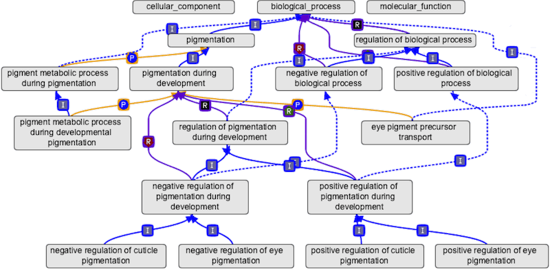
</center>

## Gene ontology structure {.larger}

Gene ontology describes multiple levels of detail of gene function.

- **Molecular Function** - the tasks performed by individual gene products; examples are _transcription factor_ and _DNA helicase_ 

>- **Biological Process** - broad biological goals, such as _mitosis_ or _purine metabolism_, that are accomplished by ordered assemblies of molecular functions 

>- **Cellular Component** - subcellular structures, locations, and macromolecular complexes; examples include _nucleus_, _telomere_, and _origin recognition complex_

## Gene ontology database

<http://geneontology.org/>

<https://www.ebi.ac.uk/QuickGO/>

<center>
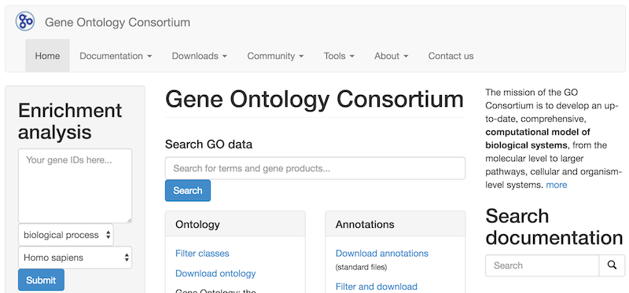
</center>

## Gene ontologies are not created equal

- Different levels of evidence: 

    - Experimental
    - Computational analysis
    - Author Statement
    - Curator Statement
    - Inferred from electronic annotation

<center>
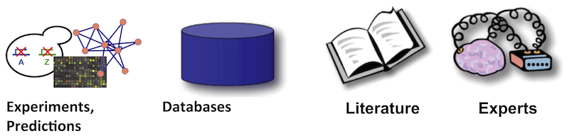
</center>

<http://geneontology.org/page/evidence-code-decision-tree>

## Gene ontologies are not created equal

<center>
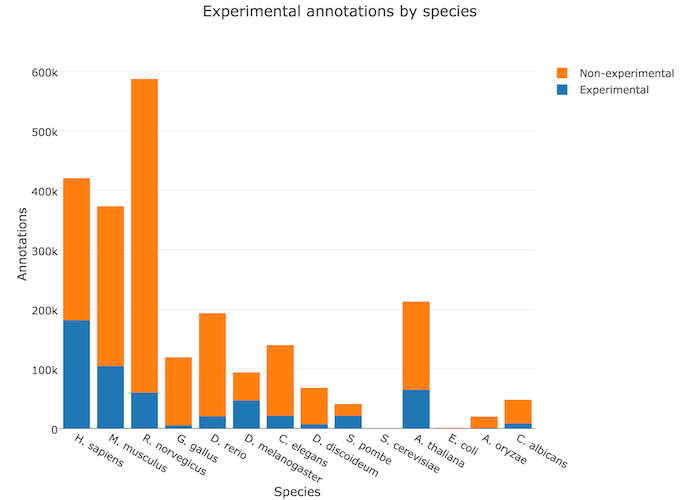
</center>

<http://amigo.geneontology.org/amigo/base_statistics>

## Gene ontologies for model organisms {.smaller}

- **Mouse Genome Database** (MGD) and Gene Expression Database (GXD) (Mus musculus) <http://www.informatics.jax.org/>
- **Rat Genome Database** (RGD) (Rattus norvegicus) <http://rgd.mcw.edu/>
- **FlyBase** (Drosophila melanogaster) <http://flybase.org/>
- **Berkeley Drosophila Genome Project** (BDGP) <http://www.fruitfly.org/>
- **WormBase** (Caenorhabditis elegans) <http://www.wormbase.org/>
- **Zebrafish Information Network** (ZFIN) (Danio rerio)  <http://zfin.org/>
- **Saccharomyces Genome Database** (SGD) (Saccharomyces cerevisiae) <http://www.yeastgenome.org/>
- **The Arabidopsis Information Resource** (TAIR) (Arabidopsis thaliana) <https://www.arabidopsis.org/>
- **Gramene** (grains, including rice, Oryza) <http://www.gramene.org/>
- **dictyBase** (Dictyostelium discoideum)  <http://dictybase.org/>
- **GeneDB** (Schizosaccharomyces pombe, Plasmodium falciparum, Leishmania major and Trypanosoma brucei) <http://www.genedb.org/>

## MSigDb - Molecular Signatures Database

<http://software.broadinstitute.org/gsea/msigdb/>

- **H**, **hallmark gene sets** are coherently expressed signatures derived by aggregating many MSigDB gene sets to represent well-defined biological states or processes.
- **C1**, **positional gene sets** for each human chromosome and cytogenetic band.
- **C2**, **curated gene sets** from online pathway databases, publications in PubMed, and knowledge of domain experts.
- **C3**, **motif gene sets**  based on conserved _cis_-regulatory motifs from a comparative analysis of the human, mouse, rat, and dog genomes.
- **C4**, **computational gene sets** defined by mining large collections of cancer-oriented microarray data.
- **C5**, **GO gene sets**  consist of genes annotated by the same GO terms.
- **C6**, **oncogenic signatures** defined directly from microarray gene expression data from cancer gene perturbations.
- **C7**, **immunologic signatures** defined directly from microarray gene expression data from immunologic studies.

## Pathways

- An ordered series of molecular events that leads to the creation new molecular product, or a change in a cellular state or process. 
- Genes often participate in multiple pathways – think about genes having multiple functions

<center>
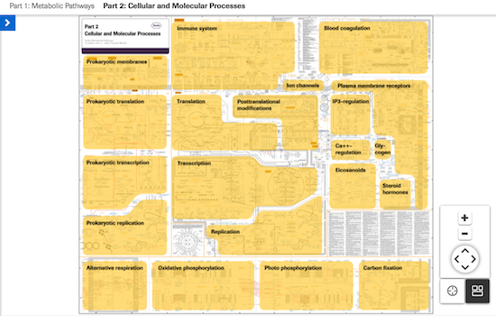
</center>

<http://biochemical-pathways.com/#/map/1>

## KEGG pathway database {.larger} 

- **KEGG: Kyoto Encyclopedia of Genes and Genomes** is a collection of biological information compiled from published material = curated database. 
- Includes information on genes, proteins, metabolic pathways, molecular interactions, and biochemical reactions associated with specific organisms
- Provides a relationship (map) for how these components are organized in a cellular structure or reaction pathway. 

<http://www.genome.jp/kegg/>

## KEGG pathway diagram

<center>
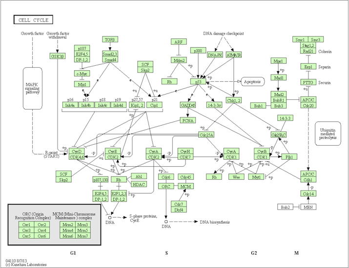
</center>

## Reactome {.larger}

- Curated human pathways encompassing metabolism, signaling, and other biological processes.
- Every pathway is traceable to primary literature.

<center>

</center>

<http://www.reactome.org/>

## Reactome pathway diagram

<center>
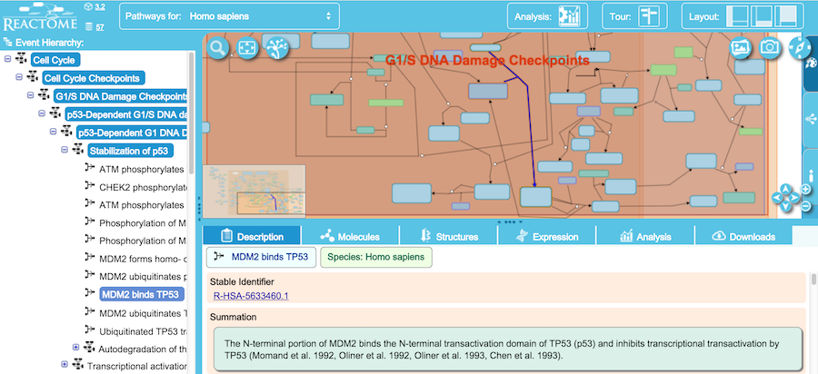
</center>

## Other pathway databases {.larger}

- <http://www.pathwaycommons.org/> - version 8 has over 42,000 pathways from 22 data sources

&nbsp;

- <http://www.pathguide.org/> - lists ~550 pathway related databases

## Overview {.larger}

- <div style="color: #808080">Why enrichment analysis?</div>
- <div style="color: #808080">What is enrichment analysis?</div>
- <div style="color: #808080">Gene ontology and pathways</div>
- **GENE ontology and pathways enrichment**
- <div style="color: #808080">Multiple testing correction</div>
- <div style="color: #808080">GENOMIC REGIONS enrichment</div>
- <div style="color: #808080">Tools and references</div>

## Enrichment analysis | Null hypothesis {.larger}

- **Self-contained $H_0$**: genes in the gene set do not have any association with the pheontype

- Problem: restrictive, use information only from a gene set
                  
<center>
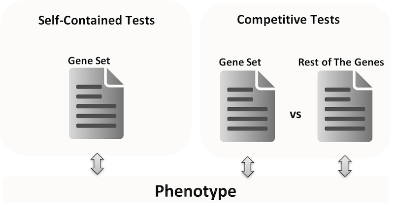
</center>

## Enrichment analysis | Null hypothesis {.larger}

- **Competitive $H_0$**: genes in the gene set have the same level of association with a given phenotype as genes in the complement gene set

- Problem: wrong assumption of independent gene sampling

<center>

</center>

## Approach 1 {.larger}

**Overrepresentation analysis, Hypergeometric test** 

- $m$ is the total number of genes
- $j$ is the number of genes are in the functional group
- $n$ is the number of differentially expressed genes
- $k$ is the number of differentially expressed genes in the group

<center>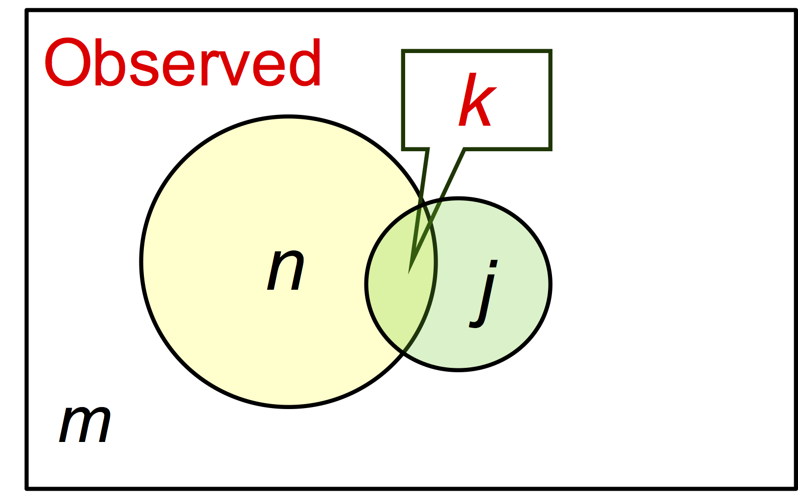</center>

## Approach 1 {.larger}

**Overrepresentation analysis, Hypergeometric test** 

- $m$ is the total number of genes
- $j$ is the number of genes are in the functional group
- $n$ is the number of differentially expressed genes
- $k$ is the number of differentially expressed genes in the group

|                    | Diff. exp. genes | Not Diff. exp. genes | Total |
|--------------------|:----------------:|:--------------------:|:------|
| In gene set        |        k         |           j-k        | j     |
| Not in gene set    |       n-k        |         m-n-j+k      | m-j   |
| Total              |       n          |           m-n        |  m    |

## Approach 1 {.larger}

**Overrepresentation analysis, Hypergeometric test** 

- $m$ is the total number of genes
- $j$ is the number of genes are in the functional group
- $n$ is the number of differentially expressed genes
- $k$ is the number of differentially expressed genes in the group

What is the probability of having $k$ or more genes from the group in the selected $n$ genes?

$$P = \sum_{i=k}^n{ \frac{{m-j \choose n-i}{j \choose i}}{{m \choose n}} }$$


## Approach 1 {.larger}

**Overrepresentation analysis (ORA)**

1. Find a set of differentially expressed genes (DEGs)
2. Are _DEGs in a set_ more common than _DEGs not in a set_?

- Fisher test `stats::fisher.test()`
- Conditional hypergeometric test, to account for directed hierachy of GO `GOstats::hyperGTest()`

&nbsp;

Example: https://github.com/mdozmorov/MDmisc/blob/master/R/gene_enrichment.R

## Approach 1 {.larger}

**Problems**

- Results significantly affected by the selected threshold

- Many genes with moderate but meaningful expression changes are discarded

- Wrong assumption that genes are independent

## Approach 2 {.larger}

**Functional Class Scoring (FCS)**

- **Gene set analysis (GSA)**. Mootha et al., 2003; modified by Subramanian et al., 2005.

- Main rationale – functionally related genes often display a coordinated expression to accomplish their roles in the cells

- Aims to identify gene sets with "subtle but coordinated"  expression changes that would be missed by DEGs threshold selection

## Approach 2

1. Sort genes by log fold change
2. Calculate running sum - increment when gene in a set, decrement when not
3. Maximum of the runnig sum is the enrichment score - larger means genes in a set are toward top of the sorted list
4. Permute subject labels to calculate significance p-value

<center>
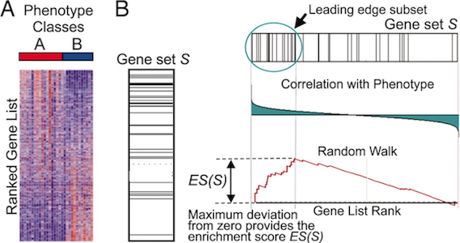
</center>

## Other approaches {.larger}

**Linear model-based**

- **CAMERA** (Wu and Smyth 2012)
- **C**orrelation-**A**djusted **ME**an **RA**nk gene set test
- Estimating the variance inflation factor associated with inter-gene correlation, and incorporating this into parametric or rank-based test procedures

## Other approaches {.larger}

**Linear model-based**

- **ROAST** (Wu et.al. 2010)
- Under the null hypothesis (and assuming a linear model) the residuals are independent and identically distributed $N(0,\sigma_g^2)$.
- We can _rotate_ the residual vector for each gene in a gene set, such that gene-gene expression correlations are preserved.

## Other approaches {.larger}

**Impact analysis** - incorporates topology of the pathway.

- Gene's fold change 
- Classical enrichment statistics
- The topology of the signaling pathway

<center>
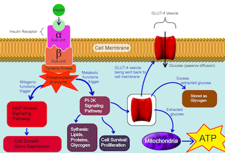
</center>

## Other approaches {.larger}

- **Pathway-Express**, <http://vortex.cs.wayne.edu/projects.htm#Pathway-Express>

Sorin Draghici et al., “A Systems Biology Approach for Pathway Level Analysis,” _Genome Research_. 2007. https://www.ncbi.nlm.nih.gov/pubmed/17785539

&nbsp;

- **SPIA**: Signaling Pathway Impact Analysis, <https://bioconductor.org/packages/release/bioc/html/SPIA.html>

Adi Laurentiu Tarca et al., “A Novel Signaling Pathway Impact Analysis,” _Bioinformatics_.  2009

## Overview {.larger}

- <div style="color: #808080">Why enrichment analysis?</div>
- <div style="color: #808080">What is enrichment analysis?</div>
- <div style="color: #808080">Gene ontology and pathways</div>
- <div style="color: #808080">GENE ontology and pathways enrichment</div>
- **Multiple testing correction**
- <div style="color: #808080">GENOMIC REGIONS enrichment</div>
- <div style="color: #808080">Tools and references</div>

## Multiple testing problem {.larger}

- With thousands of pathways to test for enrichment we’re not testing one hypothesis, but many hypotheses – one for each pathway

- Analysis of 2,000 pathways using commonly accepted significance level $\alpha=0.05$ will identify 100 enriched pathways simply by chance

- If probability of making an error in one test is 0.05, probability of making at least one error in ten tests is
$$1-(1-0.05)^{10}=0.40126$$

## Error rates {.larger}

False Discovery rate (FDR)

$$E \left[ \frac{False \; Discoveries}{True \; Discoveries}  \right]$$

Family wise error rate (FWER)

$$Pr(Number \; of \; False \; positives \ge 1)$$

Expected number of false positives

$$E[Number \; of \; False \; positives]$$

## Interpretation {.larger}

Suppose 550 out of 10,000 genes are significant at $\alpha = 0.05$

**P-value < 0.05**

- Expect $0.05*10,000=500$ false positives

**False Discovery Rate < 0.05**

- Expect $0.05*550=27.5$ false positives

**Family Wise Error Rate < 0.05**

- The probability of at least 1 false positive is $\le 0.05$

## Permutation based methods {.larger}

**Permutation based adjusted p-values**

- Under the $H_0$, the joint distribution of the test statistics can be estimated by permutation

1) Permute genes $b$ times, $b=1, ..., B$
2) Select random gene set
3) Compute enrichment test statistics $t_{b}$
4) The permutation distribution of the test statistics $T$ for the hypothesis $H_A$ is given by the empirical distribution of $t_1, ..., t_B$

## Permutation based methods {.larger}

- For two-sided alternative hypotheses, the permutation p-value for hypothesis $H_j$ is

$$p = \frac{\sum_{b=1}^B{I(\vert{t_b}\vert \ge \vert{t}\vert)}}{B}$$

where $I(*)$ is the indicator function, equaling 1 if the condition in parentheses is true and 0 otherwise. $t$ is the observed t-statistics.

## Multiple Hypothesis Testing {.larger}

**Bonferroni procedure** controls Family Wise Error Rate (FWER)

- Testing $g$ null hypothesis
- Reject any $H_i$ with $p_i \le \alpha / g$
- Example: $0.05/10,000 = 0.000005$

- Controls the FWER to be $\le \alpha$ and to be equal to $\alpha$ if all hypotheses are true.
- As the number of hypotheses increases, the average power for an individual hypothesis decreases
- Very conservative; no attempt to incorporate dependence between tests

## False discovery rates {.larger}

- It may be more appropriate to emphasize the proportion of false positives among the differentially expressed genes.

- The expectation of this proportion is the false discovery rate (FDR) (Benjamini & Hochberg, 1995)

## Q-value {.larger}

- q-value is defined as the minimum FDR that can be attained when calling a "feature" significant (i.e., expected proportion of false positives incurred when calling that feature significant)

- The estimated q-value is a function of the p-value for that test and the distribution of the entire set of p-values from the family of tests being considered (Storey and Tibshiriani, PNAS, 2003)

- Thus, in the enrichment analysis, if a pathway X has a q-value of 0.013 it means that 1.3% of pathways that show pvalues at least as small as pathway X are false positives

## Q-value

<center>
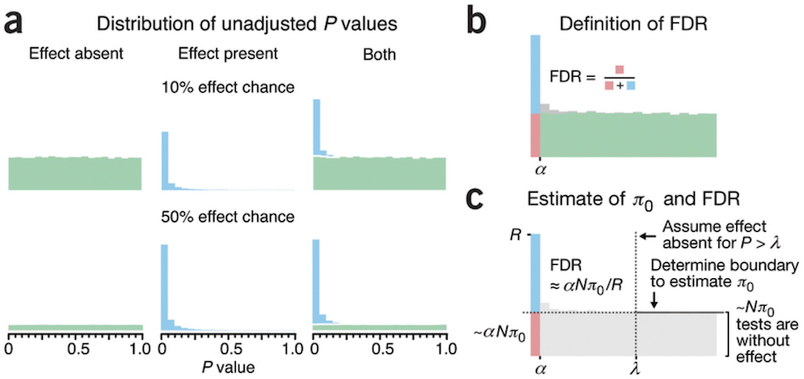
</center>

Martin Krzywinski	& Naomi Altman "Points of significance: Comparing samples—part II" _Nature Methods_  2016 http://www.nature.com/nmeth/journal/v11/n4/full/nmeth.2900.html

## Overview {.larger}

- <div style="color: #808080">Why enrichment analysis?</div>
- <div style="color: #808080">What is enrichment analysis?</div>
- <div style="color: #808080">Gene ontology and pathways</div>
- <div style="color: #808080">GENE ontology and pathways enrichment</div>
- <div style="color: #808080">Multiple testing correction</div>
- **GENOMIC REGIONS enrichment**
- <div style="color: #808080">Tools and references</div>

## Gene enrichment vs. genome enrichment {.larger}

- **Gene set enrichment analysis** - summarizing many **genes** of interest, such as differentially expressed genes, with a few common **gene annotations** (molecular functions, canonical pathways)

&nbsp;

- **Epigenomic enrichment analysis** - summarizing many **genomic regions** of interest, such as disease-associated genomic variants, with a few common **genome annotations** (chromatin states, transcription factor binding sites)

## Genomic regions {.larger}

- Gene/exon boundaries, promoters
- Single Nucleotide Polymorphisms (SNPs)
- Transcription Factor Binding Sites (TFBS)
- Differentially methylated regions
- CpG islands

Each genomic region has coordinates (unique IDs): 

`Chromosome`, `Start`, `End`

## Annotations of genomic regions {.larger}

- **Epigenomic (regulatory) regions** - genomic regions annotated as carrying functional and/or regulatory potential

- DNaseI hypersensitive sites
- Histone modification marks
- Transcription Factor Binding Sites
- DNA methylation
- Enhancers
- ...

## Genome annotation consortia

<center>

</center>

## Why "genomic region enrichment analysis"? {.larger}

Enrichment = functional impact

- **Hypothesis**: SNPs in epigenomic regions may disrupt regulation
- More significant enrichment = more SNPs in epigenomic regions = more regulation is disrupted (SNP burden)

&nbsp;

<center>

</center>

## Statistics of epigenomic enrichments {.larger}

<center>

</center>

&nbsp;

- 6 out of 7 disease-associated SNPs overlap with epigenomic marks
- How likely this to be observed by chance? (Chi-square test/Binomial test/Permutation test)

## Overview {.larger}

- <div style="color: #808080">Why enrichment analysis?</div>
- <div style="color: #808080">What is enrichment analysis?</div>
- <div style="color: #808080">Gene ontology and pathways</div>
- <div style="color: #808080">GENE ontology and pathways enrichment</div>
- <div style="color: #808080">Multiple testing correction</div>
- <div style="color: #808080">GENOMIC REGIONS enrichment</div>
- **Tools and references**

## Gene set enrichment analysis | Web  {.larger}

- **GSEA** (https://www.broadinstitute.org/gsea/index.jsp) - Better way of doing enrichment analysis
- **g:Profiler** (http://biit.cs.ut.ee/gprofiler/) - gene ID converter, GO and pathway enrichment, and more
- **ToppGene** (https://toppgene.cchmc.org) - Quick gene enrichment analysis in multiple categories
- **DAVID** (https://david.ncifcrf.gov/) - Newly updated gene enrichment analysis
- **FRY** (http://shiny.bioinf.wehi.edu.au/giner.g/FRY_GeneSetExplorerApp/) - Fast Interactive Biological Pathway Miner, from WEHI group 

## Gene set enrichment analysis | DIY  {.larger}

- **clusterProfiler** (https://bioconductor.org/packages/release/bioc/html/clusterProfiler.html) - statistical analysis and visualization of functional profiles for genes and gene clusters
- **limma** (https://bioconductor.org/packages/release/bioc/html/limma.html) - Linear Models for Microarray Data, includes functional enrichment functions `goana`, `camera`, `roast`, `romer`
- **GOstats** (https://www.bioconductor.org/packages/2.8/bioc/html/GOstats.html) - tools for manimpuating GO and pathway enrichment analyses. https://github.com/mdozmorov/MDmisc/blob/master/R/gene_enrichment.R

## Gene annotation databases

- **annotables** (https://github.com/stephenturner/annotables) - R data package for annotating/converting Gene IDs
- **msigdf** (https://github.com/stephenturner/msigdf) - Molecular Signatures Database (MSigDB) in a data frame
- **pathview** (https://www.bioconductor.org/packages/devel/bioc/html/pathview.html) - a tool set for pathway based data integration and visualization

<center>
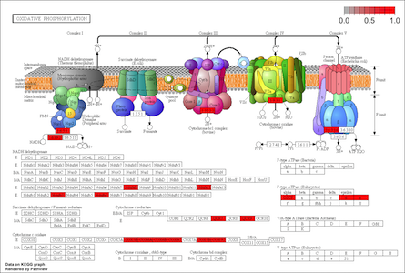
</center>

## Genomic regions enrichment analysis

<center>
```{r echo=FALSE, message=FALSE, fig.height=5, fig.width=7}
set.seed(3)
library(wordcloud)
acknowledgements <- c("EpiGraph", "EpiExplorer", "Genomic HyperBrowser", "Genomic Association Tester (GAT)", "PodBat", "EpiRegNet", "GREAT", "BEDTools", "GenometriCorr", "Genome Track Analyzer (AnCorr)", "ENCODE ChIP-Seq Significance Tool", "The Genboree Epigenome Toolset", "INRICH", "Enrichr", "BioMart Enrichment Tool", "fGWAS", "GoShifter", "FORGE", "ChIPSeeker", "LOLA", "regioneR", "GenomeRunner", "StereoGene")
frequency_of_acknowledgements <- rep(1, length(acknowledgements))
library(RColorBrewer)
pal2 <- brewer.pal(8,"Spectral")
wordcloud(words = acknowledgements, freq = frequency_of_acknowledgements, min.freq = 1, scale=c(2, 0), rot.per = 0, fixed.asp = FALSE, colors=pal2)
```
</center>

## Learn more

- Dave’s blog (http://davetang.org/muse/) search for “Gene ontology enrichment analysis” 
- Nam D., and Seon-Young K.. “**Gene-Set Approach for Expression Pattern Analysis.**” _Briefings in Bioinformatics_ 2008 https://www.ncbi.nlm.nih.gov/pubmed/18202032
- Mutation Consequences and Pathway Analysis working group. “**Pathway and Network Analysis of Cancer Genomes.**” _Nature Methods_ 2015 https://www.ncbi.nlm.nih.gov/pubmed/26125594
- Khatri, P. et.al. “**Ten Years of Pathway Analysis: Current Approaches and Outstanding Challenges.**” _PLoS Computational Biology_ 2012 https://www.ncbi.nlm.nih.gov/pubmed/22383865
- de Leeuw, C. et.al. “**The Statistical Properties of Gene-Set Analysis.**” _Nature Reviews_ 2016 https://www.ncbi.nlm.nih.gov/pubmed/27070863

## Thank you

&nbsp;

<div style="font-weight:bold; font-size: xx-large; text-align:center;">
Questions?
</div>

&nbsp;

<div style="text-align: center;">
This presentation on GitHub: 

<https://github.com/mdozmorov/presentations>
</div>

&nbsp;

<div style="font-size: small;">
Mikhail Dozmorov, Ph.D.

Assistant professor, Department of Biostatistics, VCU

mikhail.dozmorov@vcuhealth.org 
</div>