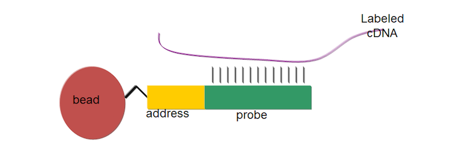

```{r setup, include=FALSE}
# Use 'verbatim = TRUE' as chunk option to show chunk code as is
require(knitr)
hook_source_def = knit_hooks$get('source')
knit_hooks$set(source = function(x, options){
  if (!is.null(options$verbatim) && options$verbatim){
    opts = gsub(",\\s*verbatim\\s*=\\s*TRUE\\s*", "", options$params.src)
    bef = sprintf('\n\n    ```{r %s}\n', opts, "\n")
    stringr::str_c(bef, paste(knitr:::indent_block(x, "    "), collapse = '\n'), "\n    ```\n")
  } else {
     hook_source_def(x, options)
  }
})
```

## DNA methylation 

- DNA methylation is a type of chemical modification of DNA which involves the addition of a methyl group to the number 5 carbon of the cytosine, to convert cytosine to 5-methylcytosine.

- The most well characterized epigenetic mechanism.

- In humans, DNA methylation occurs in cytosines that precede guanines

<center>

</center>

## CpG Sites and CpG islands

- CpG sites are not randomly distributed in the genome - the frequency of CpG sites in human genomes is 1%, which is less than the expected (~4-6%). 

- Around 60-90% of CpGs are methylated in mammals. DNA methylation frequently occurs in repeated sequences, and may help to suppress junk DNA and prevent chromosomal instability. 

## CpG Sites and CpG islands

- There are regions of the DNA that have a higher concentration of CpG sites (> 60%), named the CpG islands, which tend to be located in the promoter regions of many genes.

- Between 200-1000 bp in length

- Usually not methylated.

## Creation and maintenance of DNA methylation

- In humans, DNA is methylated by three enzymes, DNA methyltransferase DNMT1, DNMT3a, DNMT3b.

- DNMT1 is the maintenance methyltransferase that is responsible for copying DNA methylation patterns to the daughter strands during DNA replication. 

- DNMT3a and 3b are the de novo methyltransferases that set up DNA methylation patterns early in development. 

## Roles of DNA methylation

- Transcriptional gene silencing
- Maintain genome stability
- Embryonic development
- Genomic imprinting
- X chromosome inactivation (females)

<center>

</center>

## Factors associated with DNA Methylation change

- Aging (developmental stage)
- Diet
- Inflammatory patterns
- Environmental exposures
- Smoking
- Alcohol

## DNA methylation and cancer

**Hypomethylation** – decrease methylation levels

- A lower level of DNA methylation in tumors was one of the first epigenetic alterations to be found in human cancer. (Feinberg AP, et al., 1983). 
- Promoter region CpG islands demethylation of proto-oncogenes will activate the repressed gene expression
- Global hypomethylation of DNA sequences that are normally heavily methylated may result in:
    - Chromosomal instability 
    - Increased transcription from transposable elements 
    - An elevated mutation rate due to mitotic recombination

## DNA hypermethylation

**Hypermethylation** – increase methylation levels

- Hypermethylation of the CpG islands in the promoter regions of tumor-suppressor genes is a major event in the origin of many cancers.
- Hypermethylation of the CpG island promoter can inactivate tumor-suppressor genes, affect genes involved in the cell cycle, DNA repair, and the metabolism of carcinogens, all of which are involved in the development of cancer. 
- The profiles of hypermethylation of the CpG islands in tumor-suppressor genes are specific to the cancer type.

***
<center>

</center>

<div style="font-size:50%;">
Laird PW "Oncogenic mechanisms mediated by DNA methylation." Mol Med Today. 1997 http://www.cell.com/moltod/pdf/S1357-4310(97)01019-8.pdf
</div>

## Methylation assays

**Sensitivity of restriction enzymes for methylated CpG sites**

**MeDIP (Methylated DNA immuno-precipitation)**

- Anti-methylcytidine Ab to Me-C => ChIP – chip
- Doesn’t distinguish among nearby sites

## Methylation assays

**Sodium Bisulfite conversion**

- Modifies non-methylated cytosines
- Differentiation of methylated and non-methylated cytosines

- $C \; \rightarrow \; U$
- $C^M \; \rightarrow \; C$

<center>

</center>

## (m)RRBS: (multiplexed) Reduced Representation  Bisulfite Sequencing


- Utilizes cutting pattern of MspI enzyme (C^CGG) to systematically digest CpG-poor DNA
- Covers the majority of CpG islands and promoters, and a reasonable number of exons, shores and enhancers

- Advantages:
    - Only need 50-200ng DNA
    - Can be from any species
    - Cost and time 

## Application of DNA methylation assays

Early diagnosis

- Detection of CpG-island hypermethylation in biological fluids and serum

Prognosis

- Hypemethylation of specific genes
- Whole DNA methylation profiles

Prediction

- CpG island hypermethylation as a marker of response to chemotherapy

Prevention

- Developing DNMTs inhibitors as chemopreventive drugs to reactive silenced genes 

## Bisulfite conversion-based Microarray Analysis

- A DNA microarray is a technology that consists of thousands of spots with DNA oligonucleotides (probes) that are used to hybridize a target sequence.

- Probe-target hybridization is usually detected and quantified by detection of fluorophore-, or chemiluminescence-labeled targets.

<center>

</center>

## Illumina Infinium methylation assay

- Unmethylated **cytosines** are chemically deaminated to **uracil** in the presence of bisulfite.

- Methylated cytosines are refractory to the effects of bisulfite and remain cytosine. 

- After bisulfite conversion, each sample is whole-genome amplified (WGA) and enzymatically fragmented. 

- The bisulfite-converted WGA-DNA samples is purified and applied to the BeadChips.

## Illumina Infinium methylation assay

- Bead technology
- Each bead has oligos containing 23-base address + 50-base probe complementary to bisulfite converted DNA

<center>

</center>

## Illumina Infinium evolution

- 2008: HumanMethylation27K. 25,578 probes targeting CpG sites within the proximal promoter regions.

- 2011: HumanMethylation450K. 485,577 probes targeting additional CpG islands, shores and shelves, the 5' and 3' UTRs, gene bodies, some enhancer regions.

- 2015: MethylationEPIC. >850,000 probes. Additional cooverage of regulatory elements. 58% of FANTOM5 enhancers, 7% distal and 27% proximal ENCODE regulatory elements.

***
<center>

</center>

## Measurement of methylation level

Two types of probes

- **Type I probes** have two separate probe sequences per CpG site (one each for methylated and unmethylated CpGs)

- **Type II probes** have just one probe sequence per CpG site. Use half of the physical space

## Measurement of methylation level

**Beta-value**

$$\beta = \frac{M}{U + M}$$

- $M$ - signal from methylated probes
- $U$ - signal from unmethylated probes

$\beta = 0$ - all probes are non-methylated

$\beta = 1$ - all probes are methylated

## Measurement of methylation level

**Beta-value**

$$\beta = \frac{M}{U + M}$$

- $M$ - signal from methylated probes
- $U$ - signal from unmethylated probes

**M-value**

$$Mvalue=log \left( \frac{M}{U} \right)$$

$M = - \infty$ - all probes are non-methylated

$M = + \infty$ - all probes are methylated

## Measurement of methylation level

- $\beta$ values obtained from Infinium II probes are slightly less accurate and reproducible than those obtained from Infinium I probes (Dedeurwaerder et.al. 2011)
- Peak correction methods (normalization) are available

<center>

</center>

## Analysis of beta-values

- Linear regression and hope for the best
- Robust regression (Joubert BR et al EHP 2012)
- Beta-regression (Seow WJ, PLOSone 2012)

## minfi

- Reads data (Illumina’s 450k array IDAT files) into R
- Performs QC and normalization
- Identifies differential methylation positions (DMP)

```{r eval=FALSE}
source("https://bioconductor.org/biocLite.R")
biocLite("minfi")
biocLite("minfiData")
```
```{r}
library(minfi)
```

## Methylation data

```{r cache=TRUE}
baseDir <- system.file("extdata", package = "minfiData")
list.files(baseDir)
targets <- read.metharray.sheet(baseDir)
RGset <- read.metharray.exp(targets = targets)
pd <- pData(RGset) ## phenotypic data
```

## QC {.smaller}

```{r cache=TRUE, message=FALSE, fig.height=4}
densityPlot(RGset, sampGroups = pd$Sample_Group, main = "Beta", xlab = "Beta")
```

Beta values are expected to cluster around 0 or 1.

## QC

```{r cache=TRUE, fig.height=5}
par(oma=c(2,10,1,1))
densityBeanPlot(RGset, sampGroups = pd$Sample_Group, sampNames = pd$Sample_Name)
```

## Normalization

```{r cache=TRUE}
MSet.norm <- preprocessIllumina(RGset, bg.correct = TRUE, normalize = "controls", reference = 2)
```

Different methods for normalization have been proposed and still being developed

## Multi-dimensional scaling (MDS) plot  {.smaller}

```{r cache=TRUE, fig.height=4}
mdsPlot(MSet.norm, numPositions = 1000, sampGroups = pd$Sample_Group, sampNames =pd$Sample_Name)
```

Similar to PCA, useful to identify outlier samples.

## Getting M-values

```{r cache=TRUE}
## A small subset to speed up the demo:
mset <- MSet.norm[1:20000,]

## Getting the M values:
M <- getM(mset, type = "beta", betaThreshold = 0.001)
```

M values show the level of methylation centered around 0

Beta values ≤ 0.001, or more than 0.999 are truncated to avoid numerical issues.

## Differentially methylated positions

```{r cache=TRUE}
dmp <- dmpFinder(M, pheno=pd$Sample_Group, type="categorical")
head(dmp)
```

Rows ordered by p-value.

## Plotting methylation levels

```{r cache=TRUE, fig.height=4}
cpgs <- rownames(dmp)[1:4]
par(mfrow=c(2,2))
plotCpg(mset, cpg=cpgs, pheno=pd$Sample_Group)
```

## Filter questionable probes

- A list of potential nonspecific probes and polymorphic probes of Illumina Human 27k Methylation Array, [BrainCloud](http://braincloud.jhmi.edu/downloads.htm), [http://braincloud.jhmi.edu/NonspecificAndPolymorphic.zip](http://braincloud.jhmi.edu/NonspecificAndPolymorphic.zip)

- Data from Chen YA, et.al. "[Discovery of cross-reactive probes and polymorphic CpGs in the Illumina Infinium HumanMethylation450 microarray](http://www.ncbi.nlm.nih.gov/pmc/articles/PMC3592906/)." Epigenetics. 
    - [List of non-specific probes](http://www.sickkids.ca/MS-Office-Files/Research/Weksberg%20Lab/48639-non-specific-probes-Illumina450k.xlsx) - 29,233 non-specific 'cg' probes, 1,736 non-specific 'ch' probes; 
    - [List of polymorphic CpGs](http://www.sickkids.ca/MS-Office-Files/Research/Weksberg%20Lab/48640-polymorphic-CpGs-Illumina450k.xlsx) - 70,899 records (66,877 unique probes) about CpGs containing SNPs at or near single base extension (SBE) position, 316,034 records (220,582 unique probes) having SNPs in probe sequences.

- More for MethylationEPIC at https://genomebiology.biomedcentral.com/articles/10.1186/s13059-016-1066-1

## My pipeline

1. Filtering non-specific, polymorphic, SNP, chromosome Y probes
2. Pre-processing and QC
    - dasen (background correction and quantile normalization)
    - BIMQ (correcting batch effect of Infinium I and II chemistries)
    - Principal Components Analysis to detect batch effects
    - ComBat (removing batch effect)
3. Association analysis, or differential methylation
    - betareg regression model
    - Pearson correlation coefficient
    - limma
    - Benjamini-Hochberg adjusted p-value (age) < 0.05
4. Functional enrichment analyses


## References

- Pidsley, Ruth, Elena Zotenko, Timothy J. Peters, Mitchell G. Lawrence, Gail P. Risbridger, Peter Molloy, Susan Van Djik, Beverly Muhlhausler, Clare Stirzaker, and Susan J. Clark. “**Critical Evaluation of the Illumina MethylationEPIC BeadChip Microarray for Whole-Genome DNA Methylation Profiling.**” Genome Biology 17, no. 1 (October 7, 2016): 208. doi:10.1186/s13059-016-1066-1. https://genomebiology.biomedcentral.com/articles/10.1186/s13059-016-1066-1

- Pan Du, Xiao Zhang, Chiang-Ching  et al. "**Comparison of Beta-value and M-value methods for quantifying methylation levels by microarray analysis.**" BMC Bioinformatics, 11:587, 2010.

- Methylation statistics packages: Table 2 in Liu, Hongbo, Song Li, Xinyu Wang, Jiang Zhu, Yanjun Wei, Yihan Wang, Yanhua Wen, et al. “**DNA Methylation Dynamics: Identification and Functional Annotation.**” Briefings in Functional Genomics, 2016. https://www.ncbi.nlm.nih.gov/pubmed/27515490

## Thank you

&nbsp;

<div style="font-weight:bold; font-size: xx-large; text-align:center;">
Questions?
</div>

&nbsp;

<div style="text-align: center;">
This presentation on GitHub: 

<https://github.com/mdozmorov/presentations>
</div>

&nbsp;

<div style="font-size: small;">
Mikhail Dozmorov, Ph.D.

Assistant professor, Department of Biostatistics, VCU

mikhail.dozmorov@vcuhealth.org 
</div>