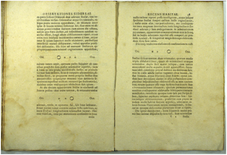
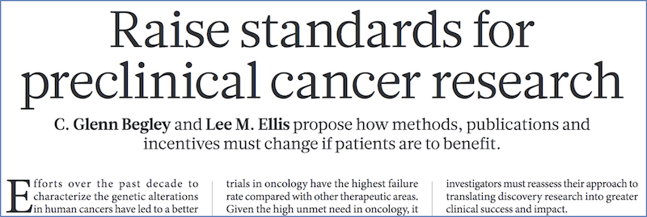
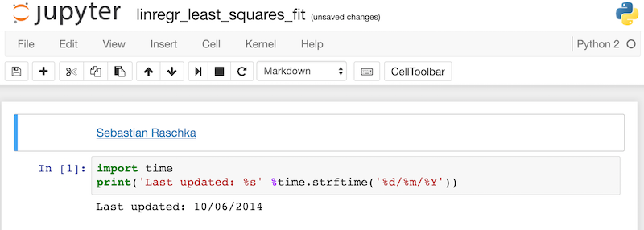
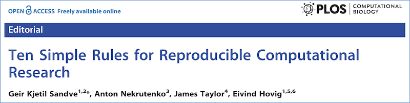

```{r setup, include=FALSE}
knitr::opts_chunk$set(echo = FALSE)
```

## Overview {.larger}

- What is reproducible research?
- Why do we care?
- Why reproducibility questions arise?
- The cost of reproducibility
- Reproducibility and statistics
- Current status of reproducibility
- What can we do?

# What is reproducible research?

<div class="midcenter" style="margin-left:-210px; margin-top:-280px;">
  
</div>

## Reproducibility and scientific progress {.larger}

- Science is the systematic enterprise of gathering knowledge about the universe and organizing and condensing that knowledge into testable laws and theories 

- The success and credibility of science are anchored in the willingness of scientists to **expose their ideas and results to independent testing and replication by other scientists.**

<div style="font-size: 60%;">
http://www.aps.org/policy/statements/99_6.cfm 
</div>

## What is reproducible research?

- Reproducibility
- Replicability
- Repeatability
- Reliability
- Robustness
- Generalizability

&nbsp;

- **Transparency** &nbsp;&nbsp;&nbsp; 
- **Open Science** &nbsp;&nbsp;&nbsp; 
- <span style="font-weight:bold; color:red;">TRUTH</span>

<div style="font-size: 60%;">
- Steve Goodman, Stanford, March 18, 2015 https://youtu.be/DrlS4HXv-uA
</div>

## What is reproducible research? {.larger}

Reproducible research is the ultimate standard for strengthening scientific evidence by independent:

- Investigators
- Data 
- Analytical methods 
- Laboratories 
- Instruments 

## The beginning of reproducible research | Galileo Galilei {.larger}

<center>

</center>

- Galileo’s notes directly integrated his data (drawings of Jupiter and its moons), key metadata (timing of each observation, weather, and telescope properties), and text (methods, analysis, and conclusions)

<div style="font-size: 60%;">
Two pages from Galilei's Sidereus Nuncius (“The Starry Messenger” or “The Herald of the Stars”), Venice, 1610. http://journals.plos.org/ploscompbiol/article?id=info:doi/10.1371/journal.pcbi.1003542
</div>

# Why do we care?

## More data = more chance for errors  {.larger}

- High-throughput biology generates volumes of data

- Data-generating technologies are increasingly used to make clinical recommendations and treatment decisions

- A problem may be overlooked .. Published .. Get in clinical trials

## More data = more chance for errors 

<center>

</center>

&nbsp;

<div style="font-size: 60%;">
- Muir et al., “The Real Cost of Sequencing.” Genome Biol. 2016

https://genomebiology.biomedcentral.com/articles/10.1186/s13059-016-0917-0
</div>

## Clinical trials based on flawed and fraudulent data

- Described drug response “gene signatures” in NCI60 cell lines
- Demonstrated these “signatures” correspond to patient-specific signatures and can be used to predict patient response to the drugs

<center>

</center>

&nbsp;
<div style="font-size: 60%;">
- Retraction Watch "The Importance of Being Reproducible: Keith Baggerly tells the Anil Potti story" 2011

http://retractionwatch.com/2011/05/04/the-importance-of-being-reproducible-keith-baggerly-tells-the-anil-potti-story/
</div>

## Clinical trials based on flawed and fraudulent data

- Described drug response “gene signatures” in NCI60 cell lines
- Demonstrated these “signatures” correspond to patient-specific signatures and can be used to predict patient response to the drugs

<center>


</center>

## Biostatisticians spot errors

<center>

</center>

&nbsp;
<div style="font-size: 60%;">
-  New York Times “How Bright Promise in Cancer Testing Fell Apart” 2011

http://www.nytimes.com/2011/07/08/health/research/08genes.html
</div>

## “Off-by-one” error

**Published**

<pre style="font-size: 130%; font-weight: bold; line-height: 200%;">
...
[3,] 1881_at      
[4,] 31321_at   
[5,] 31725_s_at 
[6,] 32307_r_at    
...
</pre>

## “Off-by-one” error

**Published**
&nbsp;&nbsp;&nbsp;&nbsp;&nbsp;&nbsp;&nbsp;&nbsp;&nbsp;&nbsp;&nbsp;&nbsp;&nbsp;&nbsp;&nbsp;&nbsp;&nbsp;&nbsp;&nbsp;&nbsp;&nbsp;&nbsp;&nbsp;&nbsp;
**Replicated**

<pre style="font-size: 130%; font-weight: bold; line-height: 200%;">
...
[3,] 1881_at       1882_g_at
[4,] 31321_at      31322_at
[5,] 31725_s_at    31726_at
[6,] 32307_r_at    32308_r_at
...
</pre>

<div style="font-size: 60%;">
-  The Importance of Reproducible Research in High-Throughput Biology, Keith Baggerly https://www.youtube.com/watch?v=7gYIs7uYbMo
</div>

## Summary of the Duke case {.larger}

- A total of 162 co-authors
- 40 papers
- Two-thirds are partially or completely retracted

<center>


</center>

## IOM guidelines on translational omics {.smaller}

<center>

</center>

&nbsp;

http://www.nationalacademies.org/hmd/reports/2012/evolution-of-translational-omics.aspx

- Kaiser J “Clinical medicine. Biomarker tests need closer scrutiny, IOM concludes.” Science 2012

http://science.sciencemag.org/content/335/6076/1554.long

- McShane LM et.al. “Criteria for the use of omics-based predictors in clinical trials.” Nature 2013

http://www.nature.com/nature/journal/v502/n7471/full/nature12564.html

## IOM guidelines on translational omics {.larger}

- **Data/metadata** used to develop test should be made publicly available

- The **computer code** and fully specified computational procedures used for development of the candidate omics-based test should be made sustainably available

- "... the computer code ... will **encompass all of the steps of computational analysis**, including all data preprocessing steps ... All aspects of the analysis need to be transparently reported"

&nbsp;

<div style="font-size: 60%;>
- Reproducible Research: Concepts and Ideas, Roger Peng https://www.youtube.com/watch?v=DfBSiOupI1I
</div>

## Why reproducibility of research issues arise?  {.larger}

<center>

</center>

&nbsp;

<div style="font-size: 60%;">
- Glenn Begley et. al. "**Robust research: Institutions must do their part for reproducibility**" Nature 2015 http://www.nature.com/news/robust-research-institutions-must-do-their-part-for-reproducibility-1.18259 
- Kendall Powell "**Hard work, little reward: Nature readers reveal working hours and research challenges**" Nature 2016 http://www.nature.com/news/hard-work-little-reward-nature-readers-reveal-working-hours-and-research-challenges-1.20933
</div>

## PubMed stats | Reproducible Research

```{r cache=TRUE, echo = FALSE}
library(ggplot2)
MDmisc::get_pubmed_graph("reproducible research", yearstart = 1970, yearend = 2016, normalize = TRUE)
```

## PubMed stats | Retraction

```{r cache=TRUE, echo = FALSE}
library(ggplot2)
MDmisc::get_pubmed_graph("retraction", yearstart = 1970, yearend = 2016, normalize = TRUE)
```

# The cost of reproducibility

<div class="midcenter" style="margin-left:-240px; margin-top:-300px;">

</div>

## Irreproducfibility ranges  ~51% - 89%

<center>

</center>

&nbsp;
<div style="font-size: 60%;">
- Leonard Freedman, Iain Cockburn, and Timothy Simcoe, “The Economics of Reproducibility in Preclinical Research.” PLOS Biol 2015

http://journals.plos.org/plosbiology/article?id=10.1371/journal.pbio.1002165
</div>

## Cost of irreproducibility

<center>

</center>

# Why reproducibility questions arise?

<div class="midcenter" style="margin-left:-220px; margin-top:-300px;">

</div>

## Patterns in the noise {.larger}

- Humans are good at recognizing patterns

<div style="font-size: 80%;">
Human beings do not have very many natural defenses. We are not all that fast, and we are not all that strong. We do not have claws or fangs or body armor. We cannot spit venom. We cannot camouflage ourselves. And we cannot fly. Instead, we survive by means of our wits. Our minds are quick. **We are wired to detect patterns** and respond to opportunities and threats without much hesitation.

- Nate Silver
</div>

<div class="midcenter" style="margin-left: 270px; margin-top: 50px;">

</div>

&nbsp;

&nbsp;

<div style="font-size: 60%;">
- Nate Silver “The Signal and the Noise: Why So Many Predictions Fail--but Some Don't” 2015

https://www.amazon.com/Signal-Noise-Many-Predictions-Fail-but/dp/0143125087
</div>

## Patterns in the noise

- Humans are good at recognizing patterns

<div class="columns-2">
<ul>


</ul>
<ul>
&nbsp;
</ul>
</div>

<div style="font-size: 60%;">
http://neuralnetworksanddeeplearning.com/chap1.html

http://www.npr.org/templates/story/story.php?storyId=130594039
</div>

## Patterns in the noise

- Humans are good at recognizing patterns

<div class="columns-2">
<ul>


</ul>
<ul>

</ul>
</div>

<div style="font-size: 60%;">
http://neuralnetworksanddeeplearning.com/chap1.html

http://www.npr.org/templates/story/story.php?storyId=130594039
</div>

## Irreproducibility in high-throughput biology {.larger}

- **Our intuition about patterns in high dimensional data quickly drops with the increased dimensionality of the data**
- We rely on computation to uncover patterns
- P-values, the ‘gold standard’ of statistical validity, are not as reliable as many researchers assume.

## Effect size: the chance of being wrong

<center>

</center>

- **The probability of irreproducibility** of studies with p-values in the range 0.005 to 0.05 **is roughly 0.33**

<div style="font-size: 60%;">
- Regina Nuzzo, “Scientific Method: Statistical errors” Nature 2014 http://www.nature.com/news/scientific-method-statistical-errors-1.14700
- Dennis Boos and Leonard Stefanski “P-value precision and reproducibility” Am Statistician, 2001 http://www.tandfonline.com/doi/abs/10.1198/tas.2011.10129
</div>

## The chance of being wrong

<center>

</center>

&nbsp;
<div style="font-size: 60%;">
http://journals.plos.org/plosmedicine/article?id=10.1371/journal.pmed.0020124

- Alex Tabarrok “Why Most Published Research Findings are False” 2005

http://marginalrevolution.com/marginalrevolution/2005/09/why_most_publis.html
</div>

## The chance of being wrong  {.larger}

1. Remember that the more hypotheses which are tested and the less selection which goes into choosing hypotheses - the more likely it is that you are looking at noise

2. Bigger samples are better

3. Small effects are to be distrusted

4. Multiple sources and types of evidence are desirable

5. Evaluate literatures not individual papers

6. Trust empirical papers which test other people's theories more than empirical papers which test the author's theory

7. As an editor or referee, don't reject papers that fail to reject the null

## The choice of being right

<center>

</center>

&nbsp;

&nbsp;

<div style="font-size: 60%;">
http://journals.plos.org/plosmedicine/article?id=10.1371/journal.pmed.1001747
</div>

## The choice of being right  {.larger}

- Large-scale collaborative research

- Adoption of replication culture

- Registration (of studies, protocols, analysis codes, datasets, raw data, and results)

- Sharing (of data, protocols, materials, software)

- More appropriate statistical methods

- Standardization of definitions and analyses

- More stringent thresholds for claiming "breakthroughs"

- ...

## Understanding the p-value


<div class="midcenter" style="margin-left: 200px; margin-top: -200px;">

</div>

&nbsp;

<div style="font-size: 60%;">
- Ronald Wasserstein and Nicole Lazar “The ASA's statement on p-values: context, process, and purpose” Am Stat 2016

http://amstat.tandfonline.com/doi/abs/10.1080/00031305.2016.1154108

- Monya Baker “Statisticians issue warning over misuse of P value” Nature 2016

http://www.nature.com/news/statisticians-issue-warning-over-misuse-of-p-values-1.19503
</div>

## Understanding the p-value  {.larger}

1. P-values can indicate how incompatible the data are with a specified statistical model

2. P-values do not measure the probability that the studied hypothesis is true, or the probability that the data were produced by random chance alone

3. Scientific conclusions and business or policy decisions should not be based only on whether a p-value passes a specific threshold

4. Proper inference requires full reporting and transparency

5. A p-value, or statistical significance, does not measure the size of an effect or the importance of a result

6. By itself, a p-value does not provide a good measure of evidence regarding a model or hypothesis

## P-value warning: consult a statistician before the experiment

<center>

</center>

# Current status of reproducibility

<center>

</center>

## Focus on preclinical research

<center>

</center>

&nbsp;

&nbsp;

<div style="font-size: 60%;">
- Glenn Begley and Lee Ellis, “Drug Development. Raise standards for preclinical cancer research” Nature 2012

http://www.nature.com/nature/journal/v483/n7391/full/483531a.html
</div>

## Focus on preclinical research

<center>

</center>

&nbsp;

&nbsp;

<div style="font-size: 60%;">
- Francis Collins and Lawrence Tabak, “Policy: NIH Plans to Enhance Reproducibility.” Nature 2014

http://www.nature.com/news/policy-nih-plans-to-enhance-reproducibility-1.14586
</div>

## NIH focus on openness

<center>

</center>

&nbsp;

&nbsp;

<div style="font-size: 60%;">
https://grants.nih.gov/reproducibility/index.htm
</div>

## NIH focus on openness {.smaller}

- **Public Access Policy**

https://publicaccess.nih.gov/

- **Data Sharing Policies**

https://www.nlm.nih.gov/NIHbmic/nih_data_sharing_policies.html

- **Genomics Data Sharing (GDS)**

https://gds.nih.gov/03policy2.html

- **Model Organism Sharing Policy**

https://grants.nih.gov/grants/policy/model_organism/

- **Research Tools Policy**

https://grants.nih.gov/grants/intell-property_64FR72090.pdf

## NSF stance on openness {.medium}

<center>

</center>

&nbsp;

<div style="font-size: 60%;">
https://www.nsf.gov/bfa/dias/policy/dmp.jsp 
</div>

## NSF stance on openness

- **Responsible Conduct of Research (RCR)**

https://www.nsf.gov/bfa/dias/policy/rcr.jsp

- **NSF Scientific Integrity Policy**

https://www.nsf.gov/bfa/dias/policy/si/index.jsp

## Reproducibility initiatives

<center>

</center>

<div style="font-size: 60%;">
http://www.nature.com/nmeth/journal/v10/n5/full/nmeth.2471.html
</div>

## Reproducibility initiatives

<center>

</center>

&nbsp;
&nbsp;

<div style="font-size: 60%;">
http://www.nature.com/nmeth/journal/v13/n10/full/nmeth.4026.html
</div>

## Reproducibility initiatives

<center>

</center>
&nbsp;

&nbsp;
<div style="font-size: 60%;">
- Victoria Stodden et.al. “Reproducible Research” Yale Law School

https://web.stanford.edu/~vcs/papers/RoundtableDeclaration2010.pdf

http://scitation.aip.org/content/aip/journal/cise/11/1/10.1109/MCSE.2009.19

https://web.stanford.edu/~vcs/Talks.html
</div>

## Reproducibility initiatives

<center>

</center>

https://cos.io/

<center>

</center>

https://osf.io/

## Reproducibility guidelines

- **ARRIVE** – Animal Research Reporting of In Vivo Experiments
- **CONSORT** – Consolidated Standards of Reporting Trials
- **SPIRIT** – Standard Protocol Items: Recommendations for Interventional Trials
- **STROBE** – The Strengthening the Reporting of Observational Studies in Epidemiology
- **(STARD) TRIPOD** – Transparent Reporting of a multivariable prediction model for Individual PROgnosis of Diagnosis
- **REMARK** – REporting recommendations for tumour MARKer prognostic studies

<center>

</center>

<div style="font-size: 60%;">
http://www.equator-network.org/ - over 300 reporting guidelines
</div>

# What can we do | Tools to enhance reproducibility?

<center>

</center>

## Flavors of reproducibility {.larger}

- Empirical reproducibility

- Computational reproducibility

- Statistical reproducibility

## Flavors of reproducibility {.larger}

- Empirical reproducibility

- **Computational reproducibility**

- Statistical reproducibility

## Steps in reproducible research {.larger}

**The most important is the mindset, when starting, that the end product will be reproducible.**

<div style="text-align:right;"> – Keith Baggerly</div>

## Steps in reproducible research {.larger}

**The most important is the mindset, when starting, that the end product will be reproducible.**

<div style="text-align:right;"> – Keith Baggerly</div>

- Experimental design
- Data generation
- Data analysis
- Results interpretation
- Dissemination of results

## Common approach | write report around results

- Point and click approach: Use MS Excel for data entry/cleaning/preparation, and possibly statistical analysis

<center>

</center>

&nbsp;

<div style="font-size: 60%;">
- Zeeberg BR et al. “Mistaken identifiers: gene name errors can be introduced inadvertently when using Excel in bioinformatics” BMC Bioinformatics 2004

http://bmcbioinformatics.biomedcentral.com/articles/10.1186/1471-2105-5-80
</div>

## Common approach | write report around results {.larger}

**Problems**

- With point-and-click, there’s no way to record/save the steps that generated the (copy/pasted) results

- Data files are kept separately from the analysis code, and from reports

- After modifications of one of the files, it becomes unclear which version corresponds exactly to the reported results

- Every time something changes, you have to regenerate the figures/results/reports by hand – very time consuming

## Data organization | in spreadsheets 

- Explicitly import text data as text, numeric as numeric, etc.

- One thing in a cell (avoid comments, color coding, etc.)

- Choose comprehensive variable names. Use "_" instead of spaces. Be consistent

- Save the data as CSV, comma-separated values

- Avoid calculations

<center>

<div style="font-size: 60%;">
http://kbroman.org/dataorg/
</div>
</center>

## Better approach | write report that generates results {.larger}

- The report is automated via code

- Data is attached to the well-documented code

- History of any changes should be preserved

- The final report should be self-sufficient and reproducible with a single command

## The aims of computational reproducibility {.larger}

- Fully automated report
- Including code and data

<center>

</center>

<div style="font-size: 60%;">
- Roger Peng “Reproducible Research in Computational Science” Science 2011

http://science.sciencemag.org/content/334/6060/1226
</div>

## Know your Unux {.larger}

- Unix is a family of operating systems and environments that exploits the power of linguistic abstractions to perform tasks

- Unix users spend a lot of time at the command line

- In Unix, a command is worth a thousand mouse clicks

## Makefiles | reproducibility in command line {.larger}

- **Make** is a tool which controls the workflow of generating target/result files from the dependencies/source files

- Automates/documents a workflow

- Intelligently handles the dependencies among data files, code

- Accounts for the updates in data, code

## Automate everything {.larger}

- R – free/open source programming language

- Runs on Windows, Mac, and Linux

- Extensible with a very large collection of actively developing packages

- Excellent graphics & report-creating capabilities

<center>

</center>

## R is reimagined with RStudio

<center>

</center>

## Self-documenting code {.larger}

- A report containing a stream of **text and code** chunks

- Each code chunk loads data, computes results, shows figures

- Each text chunk explains how the code chunks work

 - The resulting report is human- and machine readable

&nbsp;

&nbsp;

&nbsp;

&nbsp;

<div class="midcenter" style="margin-left:200px; margin-top:50px;">

</div>

<div style="font-size: 60%;">
- Donald E. Knuth "Literate Programming"

http://comjnl.oxfordjournals.org/content/27/2/97.short
</div>

## Evolution of literate programming  {.larger}

- **HTML** - HyperText Markup Language, used to create web pages. Developed in 1993

- **LaTeX** – a typesetting system for production of technical/scientific documentation, PDF output. Developed in 1994

- **Sweave** – a tool that allows embedding of the R code in LaTeX documents, PDF output. Developed in 2002

- **reStructuredText** - a markup syntax that plays well with Python and Sphinx documentation. Developed in 2002

- **Markdown** – a lightweight markup language for plain text formatting syntax. Easily converted to HTML. Developed in 2004

## R Markdown basics

<center>

</center>

## R Markdown basics

<center>

</center>

&nbsp;

&nbsp;

<div style="font-size: 60%;">
- The R Markdown Cheat sheet

http://shiny.rstudio.com/articles/rm-cheatsheet.html

https://www.rstudio.com/wp-content/uploads/2015/03/rmarkdown-reference.pdf
</div>

## Literate programming with knitR {.larger}

- **knitR** - a package for dynamic report generation written in R Markdown

- Supports RMarkdown, LaTeX, MathJax. PDF, HTML, DOCX output

- Developed in 2012 by Yihui Xie

<center>

</center>

&nbsp;

<div style="font-size: 60%;">
http://yihui.name/knitr/ 
</div>

## Literate programming with knitR {.larger}

- Code chunks separated by **```**. Inline code allowed

- Graphics, code generated and external images

- Tables, code generated and in RMarkdown format

- Caching long code chunks

- Code chunks and results output fully customizable

## Literate programming with knitR {.larger}

- Mix markdown with code

<center>

</center>

## Literate programming with knitr

- "Knit" a report with one command

<center>

</center>

<center>

</center>

Literate programming in other languages

## Keeping history of changes  {.larger}

<center>

</center>

<div style="font-size: 60%;">
http://www.phdcomics.com/comics/archive.php?comicid=1531
</div>

## Version control – what and when did you do {.larger}

**Git and GitHub – version control system**

- Each project stored in its own repository

- Keep history of changes – track what you did

- Ability to go back if something breaks

- Branch out, go creative, then merge or revert the changes

- Collaborate through merging changes from multiple people

## Version control – what and when did you do {.larger}

- **Git** is a command line tool
- **GitHub.com** is a web-based storage for your project repositories

&nbsp;

- Subversion, https://subversion.apache.org/
- Mercurial, https://www.mercurial-scm.org/

## Version control – what and when did you do {.larger}

- **Git** is a command line tool
- **GitHub.com** is a web-based storage for your project repositories

&nbsp;

- <span style="font-family: monospace; font-weight:bold; color:red;">Git add</span> – add a file to version control system
- <span style="font-family: monospace; font-weight:bold; color:red;">Git commit</span> – make a snapshot of current changes
- <span style="font-family: monospace; font-weight:bold; color:red;">Git push/pull</span> – send/get 
changes to/from GitHub

## Reproducibility for other languages {.larger}

**IPython/Jupyter Notebooks **

- Combine text, equations, code, and graphics
- Markdown support
- Multiple languages support (>40)

&nbsp;

<center>

</center>

<div style="font-size: 60%;">
https://jupyter.org/
</div>

## Reproducibility for the whole project {.larger}

**Research environments**

- **Galaxy**, https://usegalaxy.org/

- **GenePattern**, http://www.broadinstitute.org/cancer/software/genepattern/

- **Taverna**, https://taverna.incubator.apache.org/introduction/

## Reproducibility for the whole projects {.larger}

**Docker** - an envelope (or container) for the whole project environment ~ lightweight virtual machine

- OS-independent, portable application images
- Preserves all application dependencies
- Easy to distribute

<center>

</center>

&nbsp;

<div style="font-size: 60%;">
https://www.docker.com/
</div>

## Question your project {.larger}

- Are the tables and figures reproducible from the code and data?

- Does the code actually do what you think it does?

- In addition to what was done, is it clear why it was done? (e.g., how parameter settings were chosen?)

- Is your code scalable to accommodate more data/methods?

## Six degrees of reproducibility {.larger}

0. The results cannot be reproduced

1. The results cannot seem to be reproduced

2. Reproducibility requires extreme effort

3. Reproducibility requires considerable effort

4. Easy reproducibility, but require some proprietary source packages (MATLAB, SAS, etc.)

5. The results can be easily reproduced by an independent researcher with at most 15 min of user effort, requiring only standard, freely available tools (C compiler, R, Python, etc.)

## Reproducibility 101  {.larger}

- Begin with the final product in mind

- Use literate programming (self-documenting code)

- Keep history of changes via code versioning and sharing

- Get basic statistics right

- Set stringent cutoffs, correct p-values for multiple testing

- Be critical, consider batch effects, visualize, do sanity checks, use random controls, cross-validation

- Follow reporting guidelines

# Learn more

## Nature “Statistics for Biologists”

<center>

</center>

<div style="font-size: 60%;">
http://www.nature.com/collections/qghhqm 
</div>

## Statistics Notes in the British Medical Journal

<center>

</center>

<div style="font-size: 60%;">
https://www-users.york.ac.uk/~mb55/pubs/pbstnote.htm
</div>

## Reproducible research made simple

<center>

</center>

<div style="font-size: 60%;">
https://www.ncbi.nlm.nih.gov/pubmed/24204232 
</div>

&nbsp;

<center>

</center>

<div style="font-size: 60%;">
https://www.ncbi.nlm.nih.gov/pubmed/24415924 
</div>

## Practical reproducibility {.larger}

- **BIOS 692 “Reproducible Research Tools”**

- https://mdozmorov.github.io/BIOS692/ 

- References https://mdozmorov.github.io/BIOS692/pages/references.html

## Acknowledgements

```{r echo=FALSE, message=FALSE, fig.height=5, fig.width=7, cache=TRUE}
set.seed(3)
library(wordcloud)
acknowledgements <- c("Karl Broman", "Greg Wilson", "Software Carpentry", "RStudio", "Victoria Stodden", "Roger Peng", "Data Carpentry", "Center for Open Science", "Rafael Irizarry", "Jeff Leek")
frequency_of_acknowledgements <- rep(1, length(acknowledgements))
wordcloud(words = acknowledgements, freq = frequency_of_acknowledgements, min.freq = 1, scale=c(2.3, 3), rot.per = 0)
```

## Thank you {.larger}

&nbsp;

&nbsp;

<center>
Questions?
</center>

&nbsp;

&nbsp;

<div style="text-align: center; font-size: small">
This presentation on GitHub: 

https://github.com/mdozmorov/presentations

&nbsp;

&nbsp;

Mikhail Dozmorov, Ph.D.

Assistant professor, Department of Biostatistics, VCU

mikhail.dozmorov@vcuhealth.org 
</div>
